# RamSleuth v2 — Full Scope vs. Completed

> **Authoritative "full project scope vs. what is done" reference.** Self-contained: a new reader should understand the entire project from this document alone.
> **Branch:** `v2-development` — **100% local, never pushed.** **Status date:** 2026-09-13 (Cycle 3 close-out).
> **Grounded in:** `Docs/HANDOVER.md`, `Docs/Grand Design & Architecture Specification.md`, `Docs/RamSleuth-v2.md`, `MASTER_LOG.md`, `plans/PLAN-PHASE3.md`, workspace `Cargo.toml` (7 members).

---

## 1. Project Vision

RamSleuth v2 is a 100% pure-Rust (Cargo workspace) Linux memory diagnostics suite that replaces the Windows overclocker trio — ZenTimings, ASRock Timing Configurator / MemTweakIt, AIDA64 — with one native tool for Linux x86_64. It provides three layers: **(1) live memory-controller telemetry** — active trained subtimings, clocks (MCLK/UCLK/FCLK, gear/div modes, GDM/PDM), CAD-bus drive strengths & terminations, and voltages, read from AMD SMU (via the `ryzen_smu` driver) and Intel MCHBAR (via `/dev/mem`), plus SPD EEPROM decode (JEP106 makers, rank, XMP 2.0/3.0, EXPO); **(2) a native AVX2/AVX-512 benchmark engine** producing an AIDA64-style 4×4 grid (Read/Write/Copy/Latency × Memory/L3/L2/L1); and **(3) a privilege-separated architecture** — one privileged daemon holding `CAP_SYS_RAWIO` owns all hardware I/O, while unprivileged CLI/TUI/GUI clients talk to it over a Unix domain socket. The GUI is egui + eframe, the TUI is ratatui + crossterm; there is no Python, C++, Qt, Electron, or Tauri anywhere.

**Success criteria (Grand Design §7):** live subtiming readout matching ZenTimings (AMD) / ASRock TCC (Intel); benchmark parity with AIDA64 (DRAM bandwidth ±5%, latency ±2 ns — parity gate deferred to a DDR5-6000 AM5 host); no elevated-privilege UI; daemon degrades gracefully on unsupported hardware with zero panics/segfaults; clean `cargo build --workspace --release`.

---

## 2. Architecture — the Concrete Deliverable

The workspace root `Cargo.toml` defines exactly these **7 member crates** (Edition 2021, resolver 2, `rust-version = 1.75`, MIT, `version 0.1.0`):

| Crate | Role | Phase | Status |
|---|---|---|---|
| `ramsleuth-bench` | Native benchmark engine: runtime AVX2/AVX-512F feature detect, /sys topology (SMT-filtered, per-CCD L3), pure 64-byte-aligned buffer plan (L1 16 KiB / L2 256 KiB / L3 50% of CCD slice / DRAM max(256 MiB, 3×L3) / 128 MiB latency ring), AVX2 + AVX-512F streaming read / NT write / copy kernels with scalar fallback, pinned barrier-synced per-core worker dispatch, 64-byte-stride pointer-chase latency (`__rdtscp`), 4×4 grid orchestrator, verification CLI (deps: `libc` only) | 1 | ✅ COMPLETE |
| `ramsleuth-telemetry` | Live memory-controller telemetry: CPUID vendor + frozen generation map (5950X → `Amd(Zen3)`), no-panic `Section<T> { Value, Na(reason) }` contract, privilege-guarded AMD SMU access (sysfs-first `/sys/kernel/ryzen_smu/pm_table` → char-dev `/dev/ryzen_smu` ioctl), version-guarded AMD PM parse (SMU 7.11.x / 12.x / 13.x), Intel MCHBAR `/dev/mem` read-only mmap guard + per-channel IMC decode, unprivileged `ee1004` SPD acquire + decode (JEP106, rank, XMP/EXPO), `SystemMemoryTelemetry` facade + `collect()`, verification CLI (deps: `nix` 0.29 only) | 2 | ✅ COMPLETE |
| `ramsleuth-protocol` | The wire contract: `Request` / `Response` / `BenchMode` / `Message` serde enums (payload types reused verbatim from telemetry + bench), `DEFAULT_SOCKET_PATH` (`/run/ramsleuth/ramsleuth.sock`), length-prefixed Bincode 1.3 frame codec with a 16 MiB `MAX_FRAME_SIZE` guard (zero `unsafe`, tokio-free) | 3 | ✅ COMPLETE |
| `ramsleuth-daemon` | The privileged daemon (the ONLY process touching hardware): SOFT capability probe (geteuid + `CapEff` bit 21 — never panics/exits), socket listener (mode 0660, stale-file probe → rebind, best-effort `chown`), TTL `TelemetryCache` (injectable collector), single-flight `BenchJobManager` (clean cancel + per-cell progress), per-connection async RPC (tokio is the daemon-only dependency), bin (`--socket` / `--max-age`, SIGTERM/SIGINT graceful stop) + `systemd/ramsleuth.service` (CAP_SYS_RAWIO-clamped, sandboxed unit) | 3 | ✅ COMPLETE |
| `ramsleuth-client` | The unprivileged CLI + shared IPC library: synchronous `UnixStream` transport (read/write timeouts, 3-retry backoff, friendly `DaemonDown` diagnostics), pure `dump` dashboard renderer (full hardware timings, every N/A cell with its reason — **the Phase 3 exit criterion**), `bench` / `status` commands, CLI (`dump` / `bench` / `status` + `--socket` / `--tier` / `--mode`, exit codes 0/1/2) | 3 | ✅ COMPLETE |
| `ramsleuth-tui` | Terminal dashboard: ratatui 0.29 + crossterm 0.28 (MSRV ≤ 1.75 via two lockfile pins), pure `key_to_action` (R / S / Q), 3-zone non-scrolling layout (timing matrix / bench grid + progress / SPD + daemon status), terminal loop with a background 2 s updater | 4 | ✅ COMPLETE |
| `ramsleuth-gui` | Desktop dashboard: egui / eframe / egui_extras 0.27.2 (newest 1.75-compatible line), semantic palette (cyan / amber / slate / crimson), F2 PNG snapshot / F3 JSON export to `$HOME`, `TelemetryData` behind `Arc<RwLock>` with a background poller (bench command channel + cancel), 3 zones, 1400×900 @ ~60 FPS eframe app | 4 | ✅ COMPLETE |

**Architecture in one line:** hardware I/O (SMU / MCHBAR `/dev/mem` / `ee1004`) lives exclusively in the `ramsleuth-daemon` process; the `protocol` crate is the single source of truth for the wire contract; `client` (std-only, no tokio) is the transport shared by the CLI and by `tui`/`gui`, which are pure renderers.

---

## 3. Full Scope by Phase

Status legend: ✅ COMPLETE · ⏳ PENDING / OPEN (carried forward, not a defect)

### Phase 1 — Native Benchmark Engine (`ramsleuth-bench`) — ✅ COMPLETE (Cycle 1, 11 chunks P1-01…P1-11, QA 7/7 gates PASS)

- AVX2 + AVX-512 read/write/copy kernels (512-bit with documented AVX2 runtime fallback) ✅
- Pinned multi-thread worker dispatch (one `sched_setaffinity`-pinned worker per physical core, SMT siblings excluded, barrier lockstep, exact-once partition) ✅
- 64-byte-stride pointer-chase latency kernel (Fisher-Yates prefetcher-defeat, serialized `__rdtscp`, non-x86_64 fallback) ✅
- L1/L2/L3/DRAM partitioning (pure `plan(&CpuTopology) -> BufferPlan`, all 64-byte aligned, safe sysfs fallbacks) ✅
- 4×4 AIDA64-style grid (Read/Write/Copy/Latency × Memory/L3/L2/L1; best-of-3 bandwidth, median latency; DRAM latency chases a materialized buffer beyond L3) ✅
- Verification CLI (`cargo run -p ramsleuth-bench [--avx512] [--json]`; serde-free JSON, unknown flag → exit 2) ✅
- ⏳ OPEN: L1/L2 small-tier bandwidth overhead refinement — the 32 KiB / 1 MiB working sets split across 16 pinned workers are dominated by thread/barrier/timing overhead per pass; **fix: add inner-loop iterations to amortize that overhead** (cells currently informational, not comparable across tiers)

### Phase 2 — Live Memory Controller Telemetry (`ramsleuth-telemetry`) — ✅ COMPLETE (Cycle 2, 11 chunks P2-01…P2-11, QA 8/8 gates PASS)

- CPUID detection (vendor + frozen family→generation map; 5950X reports family `0x19` → `Amd(Zen3)`) ✅
- No-panic `Section<T> { Value(T), Na(TelemetryError) }` contract (every cell renders a value or `N/A (<reason>)`; exit 0 even when all sections are `Na`; no `panic!`, no `unwrap`/`expect` on hardware data) ✅
- Privilege-guarded AMD SMU access — sysfs-first `/sys/kernel/ryzen_smu/pm_table` + char-dev `/dev/ryzen_smu` fallback; `nix` 0.29 is the only dependency (the `ryzen_smu` Rust crate is deliberately NOT used) ✅
- Version-guarded, bounds-checked AMD PM parse (keyed on SMU version 7.11.x / 12.x / 13.x, not on CPU generation) ✅
- Intel MCHBAR `/dev/mem` guard (Intel-gated before any file/mmap; read-only mmap, bounds-checked reads, `munmap` in `Drop`; STRICT_DEVMEM EIO/ENODATA → `InsufficientPrivilege`) + per-channel IMC decode ✅
- SPD EEPROM acquire (world-readable `ee1004` sysfs, 512 B DDR4 / 1024 B DDR5) + decode (JEP106 module/die makers with continued-ID, rank bits, part/serial, JEDEC speed, XMP 2.0/3.0 + EXPO summaries) ✅
- `SystemMemoryTelemetry` facade + `collect()` (per-branch error containment) ✅
- Verification CLI (`cargo run -p ramsleuth-telemetry [--json]`) ✅
- ⏳ OPEN: AMD tick-identical ground truth — needs the `ryzen_smu` module built + loaded + root on the 5950X host; then compare vs the `ryzen_smu` CLI's own readout: clocks ±1 MHz, voltages ±10 mV, CAD per RZQ/code table
- ⏳ OPEN: Intel live MCHBAR decode verification — on the LGA-1151 i5-6600 (Skylake, dual-channel = `channel_count(Skylake) = 2`); confirm per-channel timings + command-rate/gear decode against known-good values
- ⏳ OPEN: Model reconciliation — AMD PM byte offsets (P2-04) + Intel IMC register offsets (P2-07) are **plan-mandated SKELETONS** (version-guarded + bounds-checked, not yet reconciled against live silicon); SPD maker `0xC1` (rendered raw-hex) + density `0x0D` (→ `Na`) observed on the 5950X host are outside the frozen decode tables

### Phase 3 — Privilege-Separated Architecture (daemon + socket + clients) — ✅ COMPLETE (Cycle 3, 30 chunks P3-01…P3-30 + 2 doc-drift fixes)

- `ramsleuth-protocol`: `Request` / `Response` / `BenchMode` / `Message` + `DEFAULT_SOCKET_PATH` + length-prefixed Bincode frame codec (16 MiB guard) ✅
- Serde wire foundation: **all** telemetry (CPUID / AMD / Intel / SPD / facade) + bench (worker / orchestrator / streamed) public types wire-serializable with bincode round-trip tests; frozen payload shapes reused verbatim (no duplication) ✅
- `ramsleuth-daemon`: SOFT caps probe (never panics/exits), socket listener (0660, stale-rebind, best-effort chown), TTL `TelemetryCache`, single-flight `BenchJobManager` (clean cancel + per-cell progress), per-connection async RPC, bin (`--socket` / `--max-age`, signal handling, graceful stop + socket removal), `systemd/ramsleuth.service` ✅
- `ramsleuth-client`: sync `UnixStream` transport (timeouts / 3-retry backoff / friendly `DaemonDown`), pure `dump` dashboard renderer, `bench` / `status` commands, CLI (`dump` / `bench` / `status` + `--socket` / `--tier` / `--mode`, exit codes 0/1/2) ✅
- **CORE GATE PASSED**: unprivileged `ramsleuth-client -- dump` prints full hardware timings against a running daemon (the Phase 3 exit criterion; TUI/GUI chunks only began after it) ✅
- QA (2026-09-13): **327/327 tests green in debug AND release** (whole workspace), **zero clippy warnings** (`clippy --workspace --all-targets -- -D warnings`), **MSRV 1.75** held across all 441 lockfile packages, live end-to-end verified (daemon + client + TUI under a PTY + GUI on Wayland + SIGTERM graceful stop + no-daemon exit 1), **zero panics / segfaults** ✅

### Phase 4 — TUI / GUI Dashboards — ✅ COMPLETE (folded into Cycle 3 per the Phase 3 kickoff plan)

- `ramsleuth-tui` (ratatui 0.29 + crossterm 0.28): pure key→action mapping (R / S / Q), 3-zone non-scrolling dashboard (timing matrix / bench grid + live progress / SPD + status), terminal event loop with a background 2 s updater, degrades to "daemon not connected" without crashing ✅
- `ramsleuth-gui` (egui / eframe / egui_extras 0.27.2): semantic palette, F2 PNG snapshot / F3 JSON export to `$HOME`, `TelemetryData` + background poller with a bench command channel + cancel, 3 zones, 1400×900 @ ~60 FPS app with no UI-thread blocking ✅
- Grand Design §3 three-zone layout — **LIVE MEMORY CONTROLLER & SUBTIMINGS / AIDA-STYLE BENCHMARK ENGINE / HARDWARE & SPD TELEMETRY** — implemented in both frontends ✅

### Phase 5 — Packaging & Distribution — ⏳ NOT STARTED (the next phase)

- ⏳ PKGBUILD / AUR package (`ramsleuth-git`)
- ⏳ systemd preset, and **install must create the `ramsleuth` group** — the shipped unit uses `Group=ramsleuth`, and the group must exist or the service fails to start; this is the one real install-dependency gap (the unit also documents `Group=wheel` as the fallback on systems without a `ramsleuth` group)
- ⏳ Optionally package / provision the `ryzen_smu` DKMS kernel module (AMD live subtimings) as a recommended extra
- ⏳ GitHub Actions CI (test + clippy + build matrix for `x86_64-unknown-linux-gnu`)
- ⏳ Push to GitHub — the condition is **met** (confirmed working end-result app, Cycle 3 QA) but the project is **held 100% local per policy**; ready on explicit go-ahead; never force-push

---

## 4. Cross-Cutting Open Items (carried into the next cycle)

1. **AMD tick-identical ground truth** — needs the `ryzen_smu` module built + installed + loaded + root on the 5950X host (see §5 integration steps).
2. **Intel live MCHBAR decode** — run on the i5-6600 (Skylake, LGA-1151, dual-channel) test machine.
3. **Model reconciliation** — AMD PM byte offsets + Intel IMC register offsets (both plan-mandated skeletons) and SPD maker `0xC1` + density `0x0D` (outside the frozen tables); reconcile against live silicon, then update decode tables + fixtures.
4. **Phase 1 L1/L2 bandwidth overhead refinement** — add inner-loop iterations for the small-tier working sets so the cells become comparable across tiers.
5. **MSRV 1.75 → 1.89 decision** — deferred (AVX-512F intrinsics need Rust 1.89); the workspace is deliberately kept at 1.75 via lockfile pins for ratatui/egui transitive deps; resolve as a dedicated chunk during Phase 5 packaging.
6. **Push to GitHub** — ready on explicit go-ahead (push condition met at Cycle 3 close); a deliberate, reviewed event — likely a fresh `v2` branch/tag rather than anything onto the divergent legacy `master`; **no force-pushes without sign-off**.
7. **Install dependency handling** — the installer must create the `ramsleuth` group (unit `Group=ramsleuth`); optionally provision the `ryzen_smu` DKMS module as a recommended extra.

---

## 5. Verification Environment

- **AMD dev host (primary):** Ryzen 9 5950X (Zen 3), 16C/32T, 64 MiB L3, DDR4 (2× modules, 3200 MT/s, rank-1), AVX2 (**no AVX-512** — the `--avx512` path falls back to AVX2 at runtime), CachyOS, kernel `7.2.3-1-cachyos-custom`. `ryzen_smu` is **NOT installed** (`modprobe` fails: module not found; `/sys/kernel/ryzen_smu/` absent) → live AMD telemetry renders `N/A (DriverMissing)` and degrades gracefully; no panic in any privilege/CPU state. To unblock item 4.1: install matching kernel headers → build the out-of-tree `ryzen_smu` module → `depmod -a` → `modprobe ryzen_smu` → verify `pm_table` appears.
- **Intel test machine:** LGA-1151 i5-6600 (Skylake, 6th-gen), **dual-channel (2 DIMM channels)** — matches `channel_count(Skylake) = 2` in the Intel decode model; this is where the live MCHBAR decode verification (item 4.2) runs. Intel voltages/CAD sections are out of Phase 2 scope by design → `Na(NotApplicable)` on Intel.
- **Deferred target:** the AIDA64 parity gate (DRAM bandwidth ±5%, latency in the 60–75 ns DDR5-6000 AM5 band) is deferred to a **DDR5-6000 AM5 host** — the 5950X host is DDR4 (measured DRAM latency ~81.5 ns is out of that band as expected; reported, not failed).

---

## 6. Scope Map

```mermaid
flowchart TD
    ROOT["RamSleuth v2 — 100% pure Rust Cargo workspace — Linux x86_64"]

    ROOT --> P1["Phase 1 — Benchmark Engine ✅"]
    ROOT --> P2["Phase 2 — Live Telemetry ✅"]
    ROOT --> P3["Phase 3 — Privilege Separation ✅"]
    ROOT --> P4["Phase 4 — TUI + GUI Dashboards ✅"]
    ROOT --> P5["Phase 5 — Packaging & Distribution ⏳"]

    P1 --> BENCH["ramsleuth-bench ✅"]
    BENCH --> B1["AVX2 + AVX-512 kernels ✅"]
    BENCH --> B2["Pinned worker dispatch ✅"]
    BENCH --> B3["4×4 AIDA64 grid ✅"]
    BENCH --> B4["Verification CLI + JSON ✅"]
    BENCH --> B5["L1/L2 overhead refinement ⏳"]

    P2 --> TELE["ramsleuth-telemetry ✅"]
    TELE --> T1["CPUID + no-panic Section contract ✅"]
    TELE --> T2["AMD SMU access + PM parse ✅"]
    TELE --> T3["Intel MCHBAR guard + IMC decode ✅"]
    TELE --> T4["SPD EEPROM acquire + decode ✅"]
    TELE --> T5["Facade + collect + CLI ✅"]
    TELE --> T6["AMD ground truth vs ryzen_smu ⏳"]
    TELE --> T7["Intel live decode on i5-6600 ⏳"]
    TELE --> T8["Model reconciliation ⏳"]

    P3 --> PROTO["ramsleuth-protocol ✅"]
    P3 --> DAEMON["ramsleuth-daemon ✅"]
    P3 --> CLIENT["ramsleuth-client ✅"]
    PROTO --> W1["Request/Response + Bincode frame codec ✅"]
    DAEMON --> W2["CAP_SYS_RAWIO + 0660 socket ✅"]
    DAEMON --> W3["Cache + job manager + async RPC ✅"]
    DAEMON --> W4["systemd unit ✅"]
    CLIENT --> W5["Unprivileged dump / status / bench ✅"]
    CLIENT --> W6["CORE GATE PASSED ✅"]

    P4 --> TUI["ramsleuth-tui — ratatui + crossterm ✅"]
    P4 --> GUI["ramsleuth-gui — egui + eframe ✅"]
    TUI --> X1["3 zones + R/S/Q + 2s updater ✅"]
    GUI --> X2["3 zones + F2/F3 export + 60 FPS ✅"]

    P5 --> Y1["PKGBUILD/AUR ramsleuth-git ⏳"]
    P5 --> Y2["systemd preset + create ramsleuth group ⏳"]
    P5 --> Y3["ryzen_smu DKMS recommended extra ⏳"]
    P5 --> Y4["GitHub Actions CI ⏳"]
    P5 --> Y5["Push to GitHub — ready on go-ahead ⏳"]

    ROOT -. "carried forward" .-> OPEN["Cross-cutting open items"]
    OPEN --> O1["AMD ground truth ⏳"]
    OPEN --> O2["Intel MCHBAR ⏳"]
    OPEN --> O3["Model reconciliation ⏳"]
    OPEN --> O4["L1/L2 refinement ⏳"]
    OPEN --> O5["MSRV 1.75 → 1.89 ⏳"]
    OPEN --> O6["GitHub push ⏳"]
    OPEN --> O7["Install group + DKMS ⏳"]
```



---

## 7. How to Run (quick reference, release)

The QA-verified flow: one privileged daemon; all frontends unprivileged over the socket.

```bash
# Build everything
cargo build --workspace --release

# 1) Daemon — default socket /run/ramsleuth/ramsleuth.sock (root, CAP_SYS_RAWIO via the unit)
sudo target/release/ramsleuth-daemon
#    or unprivileged local dev (0660 socket, SOFT caps probe warns and keeps serving):
target/release/ramsleuth-daemon --socket /tmp/ramsleuth.sock

# 2) CLI client — no sudo needed
target/release/ramsleuth-client -- dump                       # full hardware timings (exit-criterion command)
target/release/ramsleuth-client -- status                     # daemon + hardware status
target/release/ramsleuth-client -- bench --tier l3 --mode memory-only
#    with a dev socket:
target/release/ramsleuth-client --socket /tmp/ramsleuth.sock -- dump
#    no daemon running → exit 1 + friendly DaemonDown start hint (never a crash)

# 3) TUI (R = refresh, S = snapshot, Q = quit) / 4) GUI (F2 = PNG, F3 = JSON, Q = quit)
target/release/ramsleuth-tui
target/release/ramsleuth-gui

# Direct verification CLIs (no daemon; from Cycle 1/2 QA)
cargo run -p ramsleuth-bench --release            # [--avx512] [--json]
sudo cargo run -p ramsleuth-telemetry --release   # [--json]; root + ryzen_smu for live AMD

# systemd (unit already shipped at systemd/ramsleuth.service; Phase 5 finalizes packaging)
sudo cp systemd/ramsleuth.service /etc/systemd/system/
sudo systemctl daemon-reload && sudo systemctl enable --now ramsleuth
```

`--tier` accepts `memory | l1 | l2 | l3 | full` (default `full`); `--mode` accepts `full | memory-only` (default `full`).

---

## 8. Git / Push State

- **Dev branch:** `v2-development` — 100% local, tree clean, single local branch. **~174 commits ahead of the divergent legacy `origin/master`** (upstream `https://github.com/MadGoatHaz/RamSleuth`; treat as read-only reference — never merge into or force onto it). All 32 Cycle 3 chunk branches (30 × `branch/chunk-P3-*` + 2 doc-fixes) and every earlier Phase 1/2 chunk branch were merged via `--no-ff` and pruned at close-out.
- **Push policy (confirmed 2026-09-12, carried):** stay 100% local until a **confirmed, tested, working** end-result app exists — that condition is now **met** (Cycle 3 QA: core gate passed, 327/327 tests, live end-to-end verified). The first push, if any, is a deliberate, reviewed event (likely a fresh `v2` branch/tag, decided at push time with explicit sign-off). **No force-pushes, ever, without explicit sign-off.**
**This document: `FULLSCOPEvsCOMPLETED.md` — authored at Cycle 3 close-out (2026-09-13).**
