# RamSleuth v2 — Full Scope vs. Completed

> **Authoritative "full project scope vs. what is done" reference.** Self-contained: a new reader should understand the entire project from this document alone.
> **Branch:** `v2-development` — local tip = `2409947` (Cycle 4 final compaction) + this docs refresh; **2 commits ahead of `origin/v2-development` @ `b908f7b`**, both local-only, unpushed; prune + optional tag await operator go-ahead (HANDOVER §8). **Status date:** 2026-09-13 (Cycle 4 close-out — Phase 5 complete, ready for Cycle 5).
> **Grounded in:** `Docs/HANDOVER.md` (the standing handover — read it first), `Docs/Grand Design & Architecture Specification.md`, `Docs/RamSleuth-v2.md`, `MASTER_LOG.md` (Cycles 1–4), `plans/PLAN-PHASE5.md`, workspace `Cargo.toml` (7 members).

---

## 1. Project Vision

RamSleuth v2 is a 100% pure-Rust (Cargo workspace) Linux memory diagnostics suite that replaces the Windows overclocker trio — ZenTimings, ASRock Timing Configurator / MemTweakIt, AIDA64 — with one native tool for Linux x86_64. It provides three layers: **(1) live memory-controller telemetry** — active trained subtimings, clocks (MCLK/UCLK/FCLK, gear/div modes, GDM/PDM), CAD-bus drive strengths & terminations, and voltages, read from AMD SMU (via the `ryzen_smu` driver) and Intel MCHBAR (via `/dev/mem`), plus SPD EEPROM decode (JEP106 makers, rank, XMP 2.0/3.0, EXPO); **(2) a native AVX2/AVX-512 benchmark engine** producing an AIDA64-style 4×4 grid (Read/Write/Copy/Latency × Memory/L3/L2/L1); and **(3) a privilege-separated architecture** — one privileged daemon holding `CAP_SYS_RAWIO` owns all hardware I/O, while unprivileged CLI/TUI/GUI clients talk to it over a Unix domain socket. The GUI is egui + eframe, the TUI is ratatui + crossterm; there is no Python, C++, Qt, Electron, or Tauri anywhere.

**Success criteria (Grand Design §7):** live subtiming readout matching ZenTimings (AMD) / ASRock TCC (Intel); benchmark parity with AIDA64 (DRAM bandwidth ±5%, latency ±2 ns — parity gate deferred to a DDR5-6000 AM5 host); no elevated-privilege UI; daemon degrades gracefully on unsupported hardware with zero panics/segfaults; clean `cargo build --workspace --release`.

---

## 2. Architecture — the Concrete Deliverable

The workspace root `Cargo.toml` defines exactly these **7 member crates** (Edition 2021, resolver 2, `rust-version = 1.75`, MIT, `version 0.1.0`):

| Crate | Role | Phase | Status |
|---|---|---|---|
| `ramsleuth-bench` | Native benchmark engine: runtime AVX2/AVX-512F feature detect, /sys topology (SMT-filtered, per-CCD L3), pure 64-byte-aligned buffer plan (L1 16 KiB / L2 256 KiB / L3 50% of CCD slice / DRAM max(256 MiB, 3×L3) / 128 MiB latency ring), AVX2 + AVX-512F streaming read / NT write / copy kernels with scalar fallback, pinned barrier-synced per-core worker dispatch, 64-byte-stride pointer-chase latency (`__rdtscp`), 4×4 grid orchestrator, verification CLI (deps: `libc` only) | 1 | ✅ COMPLETE |
| `ramsleuth-telemetry` | Live memory-controller telemetry: CPUID vendor + frozen generation map (5950X → `Amd(Zen3)`), no-panic `Section<T> { Value, Na(reason) }` contract, privilege-guarded AMD SMU access (sysfs-first — canonical `/sys/kernel/ryzen_smu_drv/pm_table` + sibling `pm_table_version`/`pm_table_size`, legacy `/sys/kernel/ryzen_smu/` fallback → char-dev `/dev/ryzen_smu` ioctl), **live-verified f32 AMD PM parse (Vermeer `TableVersionId` sets — reconciled in Phase 5, P5-15)**, Intel MCHBAR `/dev/mem` read-only mmap guard + per-channel IMC decode (offsets still skeleton), unprivileged `ee1004` SPD acquire + decode (JEP106, rank, XMP/EXPO), `SystemMemoryTelemetry` facade + `collect()`, verification CLI (deps: `nix` 0.29 only) | 2 | ✅ COMPLETE |
| `ramsleuth-protocol` | The wire contract: `Request` / `Response` / `BenchMode` / `Message` serde enums (payload types reused verbatim from telemetry + bench), `DEFAULT_SOCKET_PATH` (`/run/ramsleuth/ramsleuth.sock`), length-prefixed Bincode 1.3 frame codec with a 16 MiB `MAX_FRAME_SIZE` guard (zero `unsafe`, tokio-free) | 3 | ✅ COMPLETE |
| `ramsleuth-daemon` | The privileged daemon (the ONLY process touching hardware): SOFT capability probe (geteuid + `CapEff` bit 21 — never panics/exits), socket listener (mode 0660, stale-file probe → rebind, best-effort `chown`), TTL `TelemetryCache` (injectable collector), single-flight `BenchJobManager` (clean cancel + per-cell progress), per-connection async RPC (tokio is the daemon-only dependency), bin (`--socket` / `--max-age`, SIGTERM/SIGINT graceful stop) + `systemd/ramsleuth.service` (CAP_SYS_RAWIO-clamped, sandboxed unit) | 3 | ✅ COMPLETE |
| `ramsleuth-client` | The unprivileged CLI + shared IPC library: synchronous `UnixStream` transport (read/write timeouts, 3-retry backoff, friendly `DaemonDown` diagnostics), pure `dump` dashboard renderer (full hardware timings, every N/A cell with its reason — **the Phase 3 exit criterion**), `bench` / `status` commands, CLI (`dump` / `bench` / `status` + `--socket` / `--tier` / `--mode`, exit codes 0/1/2) | 3 | ✅ COMPLETE |
| `ramsleuth-tui` | Terminal dashboard: ratatui 0.29 + crossterm 0.28 (MSRV ≤ 1.75 via two lockfile pins), pure `key_to_action` (R / S / Q), 3-zone non-scrolling layout (timing matrix / bench grid + progress / SPD + daemon status), terminal loop with a background 2 s updater | 4 | ✅ COMPLETE |
| `ramsleuth-gui` | Desktop dashboard: egui / eframe / egui_extras 0.27.2 (newest 1.75-compatible line), semantic palette (cyan / amber / slate / crimson), F2 PNG snapshot / F3 JSON export to `$HOME`, `TelemetryData` behind `Arc<RwLock>` with a background poller (bench command channel + cancel), 3 zones, 1400×900 @ ~60 FPS eframe app | 4 | ✅ COMPLETE |

**Phase 5 deliverable (not a crate — packaging/distribution):** `packaging/ramsleuth-git/` (AUR `PKGBUILD` + `.install` hooks creating the `ramsleuth` group + systemd `preset`), `packaging/ryzen-smu-dkms/` (optional DKMS extra: `PKGBUILD` + `dkms.conf`), `scripts/install-ryzen-smu-dkms.sh` (idempotent operator install helper — fully working DKMS path), `.github/workflows/ci.yml` (1.75/stable matrix: test debug+release, clippy `-D warnings`, 6-binary artifact), `packaging/README.md` (operator/end-user guide), `systemd/ramsleuth.service` (frozen, shipped). ✅ COMPLETE.

**Architecture in one line:** hardware I/O (SMU / MCHBAR `/dev/mem` / `ee1004`) lives exclusively in the `ramsleuth-daemon` process; the `protocol` crate is the single source of truth for the wire contract; `client` (std-only, no tokio) is the transport shared by the CLI and by `tui`/`gui`, which are pure renderers.

---

## 3. Full Scope by Phase

Status legend: ✅ COMPLETE · ⏳ PENDING / OPEN (carried forward, not a defect)

### Phase 1 — Native Benchmark Engine (`ramsleuth-bench`) — ✅ COMPLETE (Cycle 1, 11 chunks P1-01…P1-11, QA 7/7 gates PASS)

- AVX2 + AVX-512 read/write/copy kernels (512-bit with documented AVX2 runtime fallback) ✅
- Pinned multi-thread worker dispatch (one `sched_setaffinity`-pinned worker per physical core, SMT siblings excluded, barrier lockstep, exact-once partition) ✅
- 64-byte-stride pointer-chase latency kernel (Fisher-Yates prefetcher-defeat, serialized `__rdtscp`, non-x86_64 fallback) ✅
- L1/L2/L3/DRAM partitioning (pure `plan(&CpuTopology) -> BufferPlan`, all 64-byte aligned, safe sysfs fallbacks) ✅
- 4×4 AIDA64-style grid (Read/Write/Copy/Latency × Memory/L3/L2/L1; best-of-3 bandwidth, median latency; DRAM latency chases a materialized buffer beyond L3) ✅
- Verification CLI (`cargo run -p ramsleuth-bench [--avx512] [--json]`; serde-free JSON, unknown flag → exit 2) ✅
- ⏳ OPEN: L1/L2 small-tier bandwidth overhead refinement — the 32 KiB / 1 MiB working sets split across 16 pinned workers are dominated by thread/barrier/timing overhead per pass; **fix: add inner-loop iterations to amortize that overhead** (cells currently informational, not comparable across tiers)

### Phase 2 — Live Memory Controller Telemetry (`ramsleuth-telemetry`) — ✅ COMPLETE (Cycle 2, 11 chunks P2-01…P2-11, QA 8/8 gates PASS)

- CPUID detection (vendor + frozen family→generation map; 5950X reports family `0x19` → `Amd(Zen3)`) ✅
- No-panic `Section<T> { Value(T), Na(TelemetryError) }` contract (every cell renders a value or `N/A (<reason>)`; exit 0 even when all sections are `Na`; no `panic!`, no `unwrap`/`expect` on hardware data) ✅
- Privilege-guarded AMD SMU access — sysfs-first (canonical `/sys/kernel/ryzen_smu_drv/pm_table` + sibling `pm_table_version`/`pm_table_size`, legacy `/sys/kernel/ryzen_smu/` fallback) + char-dev `/dev/ryzen_smu` fallback; `nix` 0.29 is the only dependency (the `ryzen_smu` Rust crate is deliberately NOT used) ✅
- **AMD PM parse — LIVE-VERIFIED for Vermeer (reconciled in Phase 5, P5-15):** version = `TableVersionId` from the sibling `pm_table_version` attr (exact Vermeer 10-id + Matisse 8-id sets), headerless `f32` layout (FCLK 0x0C0 / UCLK 0x0C8 / MCLK 0x0CC MHz, VDDCR_SOC 0x0B0, MIN_LEN 0x518); on the 5950X the live decode reports MCLK/UCLK/FCLK ≈ 1792 MHz OneToOne + VDDCR_SOC ≈ 1.128 V (matches `monitor_cpu` within ±10 mV) ✅
- Intel MCHBAR `/dev/mem` guard (Intel-gated before any file/mmap; read-only mmap, bounds-checked reads, `munmap` in `Drop`; STRICT_DEVMEM EIO/ENODATA → `InsufficientPrivilege`) + per-channel IMC decode ✅ (register offsets still SKELETON — live validation pending, open item 3c)
- SPD EEPROM acquire (world-readable `ee1004` sysfs, 512 B DDR4 / 1024 B DDR5) + decode (JEP106 module/die makers with continued-ID, rank bits, part/serial, JEDEC speed, XMP 2.0/3.0 + EXPO summaries) ✅
- `SystemMemoryTelemetry` facade + `collect()` (per-branch error containment) ✅
- Verification CLI (`cargo run -p ramsleuth-telemetry [--json]`) ✅
- ⏳ OPEN: AMD tick-identical ground truth — **NOW UNBLOCKED** (the `ryzen_smu` module is installed + loaded on the 5950X host, §5): compare vs the `monitor_cpu` ground truth under matched conditions — clocks ±1 MHz, voltages ±10 mV, CAD per code table (CAD still `Na` until the SMN-attr path, open item 3a); investigate the 1792-vs-1800 MHz delta under matched conditions
- ⏳ OPEN: Intel live MCHBAR decode verification — on the LGA-1151 i5-6600 (Skylake, dual-channel = `channel_count(Skylake) = 2`); confirm per-channel timings + command-rate/gear decode against known-good values
- ⏳ OPEN: Model reconciliation — **partially done** (the Vermeer AMD PM table was reconciled in P5-15): remaining = CAD/timings/GDM/PDM via the driver's `smn` sysfs attr (SMN regs 0x50200–0x50264 — the sanctioned channel, not raw MMIO), Intel IMC register offsets (skeleton), and SPD maker `0xC1` (rendered raw-hex) + density `0x0D` (→ `Na`) observed on the 5950X host (outside the frozen decode tables)

### Phase 3 — Privilege-Separated Architecture (daemon + socket + clients) — ✅ COMPLETE (Cycle 3, 30 chunks P3-01…P3-30 + 2 doc-drift fixes)

- `ramsleuth-protocol`: `Request` / `Response` / `BenchMode` / `Message` + `DEFAULT_SOCKET_PATH` + length-prefixed Bincode frame codec (16 MiB guard) ✅
- Serde wire foundation: **all** telemetry (CPUID / AMD / Intel / SPD / facade) + bench (worker / orchestrator / streamed) public types wire-serializable with bincode round-trip tests; frozen payload shapes reused verbatim (no duplication) ✅
- `ramsleuth-daemon`: SOFT caps probe (never panics/exits), socket listener (0660, stale-rebind, best-effort chown), TTL `TelemetryCache`, single-flight `BenchJobManager` (clean cancel + per-cell progress), per-connection async RPC, bin (`--socket` / `--max-age`, signal handling, graceful stop + socket removal), `systemd/ramsleuth.service` ✅
- `ramsleuth-client`: sync `UnixStream` transport (timeouts / 3-retry backoff / friendly `DaemonDown`), pure `dump` dashboard renderer, `bench` / `status` commands, CLI (`dump` / `bench` / `status` + `--socket` / `--tier` / `--mode`, exit codes 0/1/2) ✅
- **CORE GATE PASSED**: unprivileged `ramsleuth-client -- dump` prints full hardware timings against a running daemon (the Phase 3 exit criterion; TUI/GUI chunks only began after it) ✅
- QA (2026-09-13): **327/327 tests green in debug AND release** (whole workspace), **zero clippy warnings** (`clippy --workspace --all-targets -- -D warnings`), **MSRV 1.75** held across all 441 lockfile packages, live end-to-end verified (daemon + client + TUI under a PTY + GUI on Wayland + SIGTERM graceful stop + no-daemon exit 1), **zero panics / segfaults** ✅

### Phase 4 — TUI / GUI Dashboards — ✅ COMPLETE (folded into Cycle 3 per the Phase 3 kickoff plan)

- `ramsleuth-tui` (ratatui 0.29 + crossterm 0.28): pure key→action mapping (R / S / Q), 3-zone non-scrolling dashboard (timing matrix / bench grid + live progress / SPD + status), terminal event loop with a background 2 s updater, degrades to "daemon not connected" without crashing ✅
- `ramsleuth-gui` (egui / eframe / egui_extras 0.27.2): semantic palette, F2 PNG snapshot / F3 JSON export to `$HOME`, `TelemetryData` + background poller with a bench command channel + cancel, 3 zones, 1400×900 @ ~60 FPS app with no UI-thread blocking ✅
- Grand Design §3 three-zone layout — **LIVE MEMORY CONTROLLER & SUBTIMINGS / AIDA-STYLE BENCHMARK ENGINE / HARDWARE & SPD TELEMETRY** — implemented in both frontends ✅

### Phase 5 — Packaging & Distribution — ✅ COMPLETE (Cycle 4, 15 chunks P5-01…P5-15; QA PASS; compacted to MASTER_LOG)

- **P5-01…P5-07 — packaging** ✅: AUR `ramsleuth-git` (`PKGBUILD` builds the 7-crate workspace with `--locked`, installs the 6 binaries to `/usr/bin` + the frozen daemon unit + a systemd `preset` enabling the service; the `.install` `pre_install`/`pre_upgrade` hooks create the `ramsleuth` group on the **target** system idempotently — the one real install-dependency gap, closed), optional `ryzen-smu-dkms` extra (`PKGBUILD` + `dkms.conf`, `AUTOINSTALL=yes`, safe no-in-chroot design: ships the helper as `/usr/bin/ryzen-smu-dkms-install`), the idempotent operator install helper `scripts/install-ryzen-smu-dkms.sh`, GitHub Actions CI (test debug+release + clippy `-D warnings` on a `1.75`/`stable` matrix, `fail-fast: false`, committed `Cargo.lock` never regenerated, 6-binary artifact), and the packaging README (install table, `makepkg -si` path, group/`usermod` notes, sandboxed-unit day-2 commands)
- **P5-08/09/10 — ryzen_smu uAPI reconciliation** ✅: the daemon's canonical sysfs path is `/sys/kernel/ryzen_smu_drv/pm_table` (the upstream kobject is `ryzen_smu_drv`; the legacy `/sys/kernel/ryzen_smu/` path is a secondary candidate — fixes a pre-existing wrong-path bug), the install script's default upstream is the active `amkillam/ryzen_smu` (the former `53XU/ryzen_smu` default is DEAD — HTTP 404; `RYZEN_SMU_URL` override kept), README consistent
- **P5-11/12/13/14 — ryzen_smu install-path fixes** ✅ (root-caused from three live operator runs): stage the source into `/usr/src/ryzen_smu-$PKGVER` before `dkms add` (the script cloned but never staged); the repo `dkms.conf` `MAKE`/`CLEAN` aligned to the authoritative upstream amkillam pattern (the `M=` path missing `/build` broke `dkms build`); `dkms build`/`install` now pass `${MODULE}/${PKGVER}` (DKMS 3.4.3 does not resolve a bare name); the "already installed" skip-check uses `dkms status` install-state (a build-dir existence test wrongly skipped `dkms install` after a build). The install path is fully working — `dkms status` = `ryzen_smu/1.d298366, 7.2.3-1-cachyos-custom, x86_64: installed` on the dev host
- **P5-15 — AMD PM-table model reconciliation (open item 3, Vermeer)** ✅: the first Rust-source change of the cycle (`amd_smu.rs` + `amd_pm.rs` only) — the version is sourced from the sibling `pm_table_version` file (`TableVersionId`; the blob is a headerless `f32` array — its first word is a PPT-limit float the old skeleton misread as the version), the layout is live-verified (FCLK 0x0C0 / UCLK 0x0C8 / MCLK 0x0CC MHz, VDDCR_SOC 0x0B0, MIN_LEN 0x518), and the accepted versions are the exact Vermeer 10-id set (operator's live `0x380805` in-set) + Matisse 8-id set. 328→337 tests
- **QA (Cycle 4 close):** 337/337 tests green (debug AND release, whole workspace), zero clippy warnings, MSRV 1.75 held (lockfile-pinned), release build OK, 9/9 packaging/CI/systemd files valid (`bash -n` ×4, shellcheck zero findings, YAML valid); zero `.rs`/`Cargo.*` changes in P5-01…P5-07 (P5-15 touched exactly two telemetry files); live end-to-end on the host — the AMD section populates (clocks + VDDCR_SOC; CAD/timings honest `Na`); **zero panics / segfaults** ✅
- ⏳ OPEN (operator gate, not a deliverable): push to GitHub — fast-forward `origin/v2-development` (1 commit behind local) + prune the 17 fully-merged remote `branch/chunk-p5-*` branches + optional tag (e.g. `v2.0.0`) — **only on explicit go-ahead; never force-push; no remote branch deleted until then**

---

## 4. Cross-Cutting Open Items (carried into Cycle 5)

1. **AMD tick-identical ground truth — NOW UNBLOCKED** (the `ryzen_smu` module is installed + loaded on the 5950X host — §5). Cross-check under matched conditions: `sudo monitor_cpu` vs `ramsleuth-client -- dump` (root daemon) — clocks ±1 MHz, voltages ±10 mV, CAD per the code table. CAD is currently `Na` (waits on item 3a's SMN-attr path). **Investigate the 1792-vs-1800 MHz delta** — system-state variation vs a scaling issue — under matched conditions.
2. **Intel live MCHBAR decode** — run on the i5-6600 (Skylake, LGA-1151, dual-channel) test machine; first live pass also validates the decode pipeline + reconciles the still-skeleton IMC register offsets (item 3c).
3. **Model reconciliation — partially done** (the Vermeer AMD PM table was reconciled in P5-15). Remaining: **(a)** CAD/timings/GDM/PDM via the driver's `smn` sysfs attr (SMN regs `0x50200`–`0x50264` bitfields — the sanctioned channel, **not** raw MMIO; the attr is confirmed present on the dev host); **(b)** SPD density `0x0D` + maker `0xC1` (outside the frozen decode tables; observed on the 5950X host); **(c)** Intel IMC register offsets (still SKELETON — needs the i5-6600).
4. **Phase 1 L1/L2 bandwidth overhead refinement** — add inner-loop iterations for the small-tier working sets so the cells become comparable across tiers.
5. **MSRV 1.75 vs 1.89 decision — operator call** (deferred): keep 1.75 (lockfile-pinned for the ratatui/egui transitive deps; the AVX-512F intrinsics are cfg-gated and never exercised on Zen 3; the CI `1.75` leg proves it on a clean runner) vs bump to 1.89 (requires re-verifying the lockfile pins + the CI matrix).
6. **Push to GitHub — on operator go-ahead** (see HANDOVER §8): fast-forward `origin/v2-development` to the local tip (≥ `2409947`) (NEVER force-push), prune the 17 fully-merged remote `branch/chunk-p5-*` branches, optional `v2.0.0` tag — a deliberate, reviewed event. Until go-ahead: 100% local, no remote branch deleted.

---

## 5. Verification Environment

- **AMD dev host (primary):** Ryzen 9 5950X (Zen 3, Vermeer), 16C/32T, 64 MiB L3, DDR4-3200 (2× modules, rank-1), AVX2 (**no AVX-512** — the `--avx512` path falls back to AVX2 at runtime), CachyOS, kernel `7.2.3-1-cachyos-custom`. **`ryzen_smu` is NOW INSTALLED + LOADED** (amkillam/ryzen_smu v0.1.7 via DKMS — `dkms status` = `ryzen_smu/1.d298366, 7.2.3-1-cachyos-custom, x86_64: installed`); sysfs at `/sys/kernel/ryzen_smu_drv/` (`pm_table` 2288 B, `pm_table_version` = 0x380805, `pm_table_size`, `smn` — the CAD/timings follow-up channel, `codename`/`drv_version`/`version` + command attrs). **Live AMD subtimings work:** MCLK/UCLK/FCLK ≈ 1792 MHz (OneToOne) + VDDCR_SOC ≈ 1.128 V (matches the `monitor_cpu` ground truth, at `/usr/bin/monitor_cpu` (mode 700 root), within ±10 mV); CAD/timings/other rails = honest `Na` (open item 3a). Install/re-run via `scripts/install-ryzen-smu-dkms.sh` (idempotent; DKMS `AUTOINSTALL=yes` rebuilds on kernel updates); without the module the app degrades gracefully (`N/A (DriverMissing)`, exit 0, no panic).
- **Intel test machine:** LGA-1151 i5-6600 (Skylake, 6th-gen), **dual-channel (2 DIMM channels)** — matches `channel_count(Skylake) = 2` in the Intel decode model; this is where the live MCHBAR decode verification (item 4.2) runs. Intel voltages/CAD sections are out of Phase 2 scope by design → `Na(NotApplicable)` on Intel.
- **Deferred target:** the AIDA64 parity gate (DRAM bandwidth ±5%, latency in the 60–75 ns DDR5-6000 AM5 band) is deferred to a **DDR5-6000 AM5 host** — the 5950X host is DDR4 (measured DRAM latency ~81.5 ns is out of that band as expected; reported, not failed).

---

## 6. Scope Map

```mermaid
flowchart TD
    ROOT["RamSleuth v2 — 100% pure Rust Cargo workspace — Linux x86_64"]

    ROOT --> P1["Phase 1 — Benchmark Engine ✅"]
    ROOT --> P2["Phase 2 — Live Telemetry ✅"]
    ROOT --> P3["Phase 3 — Privilege Separation ✅"]
    ROOT --> P4["Phase 4 — TUI + GUI Dashboards ✅"]
    ROOT --> P5["Phase 5 — Packaging & Distribution ✅"]

    P1 --> BENCH["ramsleuth-bench ✅"]
    BENCH --> B1["AVX2 + AVX-512 kernels ✅"]
    BENCH --> B2["Pinned worker dispatch ✅"]
    BENCH --> B3["4×4 AIDA64 grid ✅"]
    BENCH --> B4["Verification CLI + JSON ✅"]
    BENCH --> B5["L1/L2 overhead refinement ⏳"]

    P2 --> TELE["ramsleuth-telemetry ✅"]
    TELE --> T1["CPUID + no-panic Section contract ✅"]
    TELE --> T2["AMD SMU access + PM parse ✅"]
    TELE --> T2a["AMD PM model reconciled — Vermeer f32 layout + TableVersionId sets ✅"]
    TELE --> T3["Intel MCHBAR guard + IMC decode ✅ (offsets ⏳ skeleton)"]
    TELE --> T4["SPD EEPROM acquire + decode ✅"]
    TELE --> T5["Facade + collect + CLI ✅"]
    TELE --> T6["AMD ground truth vs monitor_cpu ⏳ (UNBLOCKED)"]
    TELE --> T7["Intel live decode on i5-6600 ⏳"]
    TELE --> T8["Model reconciliation ⏳ (partially done — Vermeer AMD ✅)"]

    P3 --> PROTO["ramsleuth-protocol ✅"]
    P3 --> DAEMON["ramsleuth-daemon ✅"]
    P3 --> CLIENT["ramsleuth-client ✅"]
    PROTO --> W1["Request/Response + Bincode frame codec ✅"]
    DAEMON --> W2["CAP_SYS_RAWIO + 0660 socket ✅"]
    DAEMON --> W3["Cache + job manager + async RPC ✅"]
    DAEMON --> W4["systemd unit ✅"]
    CLIENT --> W5["Unprivileged dump / status / bench ✅"]
    CLIENT --> W6["CORE GATE PASSED ✅"]

    P4 --> TUI["ramsleuth-tui — ratatui + crossterm ✅"]
    P4 --> GUI["ramsleuth-gui — egui + eframe ✅"]
    TUI --> X1["3 zones + R/S/Q + 2s updater ✅"]
    GUI --> X2["3 zones + F2/F3 export + 60 FPS ✅"]

    P5 --> Y0["15 chunks P5-01…P5-15 ✅ (QA 337/337)"]
    P5 --> Y1["AUR ramsleuth-git: PKGBUILD + .install group hooks + preset ✅"]
    P5 --> Y2["ryzen-smu-dkms optional extra: PKGBUILD + dkms.conf ✅"]
    P5 --> Y3["install helper scripts/install-ryzen-smu-dkms.sh ✅ (working DKMS path)"]
    P5 --> Y4["GitHub Actions CI: 1.75/stable matrix + 6-binary artifact ✅"]
    P5 --> Y5["ryzen_smu uAPI reconciliation: ryzen_smu_drv paths + amkillam upstream ✅"]
    P5 --> Y6["AMD PM-table model reconciliation: Vermeer f32 + TableVersionId sets ✅"]
    P5 --> Y7["Push to GitHub — ff + prune 17 branches + optional tag ⏳ (operator go-ahead)"]

    ROOT -. "carried to Cycle 5" .-> OPEN["Cross-cutting open items"]
    OPEN --> O1["AMD ground truth cross-check ⏳ (UNBLOCKED — 1792 vs 1800 delta)"]
    OPEN --> O2["Intel MCHBAR live decode ⏳ (i5-6600)"]
    OPEN --> O3["Model reconciliation ⏳ (SMN-attr CAD/timings, SPD 0xC1/0x0D, Intel IMC offsets)"]
    OPEN --> O4["P1 L1/L2 overhead refinement ⏳ (inner-loop iterations)"]
    OPEN --> O5["MSRV 1.75 vs 1.89 ⏳ (operator decision)"]
    OPEN --> O6["GitHub push + prune + tag ⏳ (operator go-ahead, ff-only)"]
```



---

## 7. How to Run (quick reference, release)

The QA-verified flow: one privileged daemon; all frontends unprivileged over the socket.

```bash
# Build everything
cargo build --workspace --release

# 1) Daemon — default socket /run/ramsleuth/ramsleuth.sock (root, CAP_SYS_RAWIO via the unit)
sudo target/release/ramsleuth-daemon
#    or unprivileged local dev (0660 socket, SOFT caps probe warns and keeps serving):
target/release/ramsleuth-daemon --socket /tmp/ramsleuth.sock

# 2) CLI client — no sudo needed
target/release/ramsleuth-client -- dump                       # full hardware timings (exit-criterion command; AMD section populated on the dev host)
target/release/ramsleuth-client -- status                     # daemon + hardware status
target/release/ramsleuth-client -- bench --tier l3 --mode memory-only
#    with a dev socket:
target/release/ramsleuth-client --socket /tmp/ramsleuth.sock -- dump
#    no daemon running → exit 1 + friendly DaemonDown start hint (never a crash)

# 3) TUI (R = refresh, S = snapshot, Q = quit) / 4) GUI (F2 = PNG, F3 = JSON, Q = quit)
target/release/ramsleuth-tui
target/release/ramsleuth-gui

# Ground truth (AMD open item 1 comparison target; installed by the ryzen_smu install helper)
sudo monitor_cpu

# Direct verification CLIs (no daemon; from the Cycle 1/2 QA lineage)
cargo run -p ramsleuth-bench --release            # [--avx512] [--json]
sudo cargo run -p ramsleuth-telemetry --release   # [--json]; root + ryzen_smu (installed) for live AMD

# systemd (unit shipped at systemd/ramsleuth.service; packaged by the AUR ramsleuth-git)
sudo cp systemd/ramsleuth.service /etc/systemd/system/
sudo systemctl daemon-reload && sudo systemctl enable --now ramsleuth

# Packaging (Phase 5, shipped): makepkg -si from packaging/ramsleuth-git/ (AUR path);
# optional AMD extra: scripts/install-ryzen-smu-dkms.sh (idempotent, sudo — already run on the dev host)
```

`--tier` accepts `memory | l1 | l2 | l3 | full` (default `full`); `--mode` accepts `full | memory-only` (default `full`).

---

## 8. Git / Push State

- **Dev branch:** `v2-development`, tree clean, single local branch — **2 commits ahead of `origin/v2-development` @ `b908f7b`** (the P5-15 review/merge commit; everything up to `b908f7b` is on origin, fast-forwarded during the cycle, no force-push): **`2409947`** (the Cycle 4 final compaction commit) + this docs refresh — both local-only, unpushed. `origin/master` is divergent legacy — the operator confirmed `v2-development` is the canonical line; treat `master` as a read-only reference (never merge into or force onto it; no need to preserve/branch from it). All 15 Cycle 4 chunk branches + the 2 earlier fixes were merged `--no-ff` and their **17 remote `branch/chunk-p5-*` branches remain on origin — all fully merged, prune candidates on go-ahead** (p5-01, p5-02, p5-02-fix, p5-03, p5-04, p5-04-fix, p5-05, p5-06, p5-07, p5-08-sysfs, p5-09-script, p5-10-readme, p5-11-dkms, p5-12-dkmsconf, p5-13-dkmsver, p5-14-dkmsinstall, p5-15-pmtable). All earlier Cycle 1–3 chunk branches were pruned at their close-outs.
- **Push policy (confirmed 2026-09-12, carried):** stay 100% local until explicit operator go-ahead — the **confirmed, tested, working** end-result app condition has been **met since Cycle 3** (and Phase 5 packaging is now done too). On go-ahead: **fast-forward** `origin/v2-development` to the local tip (≥ `2409947`) (NEVER force-push), **prune the 17 remote chunk branches** (all verified fully merged), **optional `v2.0.0` tag** (decide at push time, with explicit sign-off). Until then: no push, no remote branch deleted.

**This document: `FULLSCOPEvsCOMPLETED.md` — refreshed at Cycle 4 close-out (2026-09-13) for the Cycle 5 handover: Phase 5 marked COMPLETE (15 chunks), the Vermeer AMD PM-table model marked reconciled, open items + scope map + git state updated.**
