# RamSleuth v2 — Full Scope vs. Completed

> **Authoritative "full project scope vs. what is done" reference.** Self-contained: a new reader should understand the entire project from this document alone.
> **Branch:** `v2-development` — local tip = **`39c18f4`** (the C18-13 packaging/README merge — the running tip; **Cycles 1–17 complete + pushed**, Cycle 18 in progress); **26 commits ahead of `origin/v2-development` @ `974467a`** (the Cycle 17 post-push tip, tag `v2.0.0` on it; everything up to `974467a` is on origin; every push to date a strict fast-forward — never force-pushed); the Cycle 18 push is **C18-17 (operator standing go-ahead; strict ff; no new tag — `v2.0.0` already exists)**. **Status date:** 2026-09-19 (Cycle 17 complete + pushed (tag `v2.0.0`, default branch `v2-development`); Cycle 18 in progress — the `ramsleuth` binary rename, the self-contained `install.sh`, the pinned shared DKMS helper, AUR parity, the in-app first-run/SETUP UI; **562/562** tests green debug + release, clippy zero, MSRV 1.75, 6 binaries).
> **Grounded in:** `Docs/HANDOVER.md` (the standing handover — read it first), `Docs/Grand Design & Architecture Specification.md`, `Docs/RamSleuth-v2.md`, `MASTER_LOG.md` (Cycles 1–17), `plans/PLAN-PHASE6.md`, `plans/PLAN-CYCLE9.md`…`plans/PLAN-CYCLE18.md`, workspace `Cargo.toml` (7 members).

---

## 1. Project Vision

RamSleuth v2 is a 100% pure-Rust (Cargo workspace) Linux memory diagnostics suite that replaces the Windows overclocker trio — ZenTimings, ASRock Timing Configurator / MemTweakIt, AIDA64 — with one native tool for Linux x86_64. It provides three layers: **(1) live memory-controller telemetry** — active trained subtimings, clocks (MCLK/UCLK/FCLK, gear/div modes, GDM/PDM), CAD-bus drive strengths & terminations, and voltages, read from AMD SMU (via the `ryzen_smu` driver) and Intel MCHBAR (via `/dev/mem`), plus SPD EEPROM decode (JEP106 makers, rank, XMP 2.0/3.0, EXPO); **(2) a native AVX2/AVX-512 benchmark engine** producing an AIDA64-style 4×4 grid (Read/Write/Copy/Latency × Memory/L3/L2/L1); and **(3) a privilege-separated architecture** — one privileged daemon holding `CAP_SYS_RAWIO` owns all hardware I/O, while unprivileged CLI/TUI/GUI clients talk to it over a Unix domain socket. The GUI is egui + eframe, the TUI is ratatui + crossterm; there is no Python, C++, Qt, Electron, or Tauri anywhere.

**Success criteria (Grand Design §7):** live subtiming readout matching ZenTimings (AMD) / ASRock TCC (Intel); benchmark parity with AIDA64 (DRAM bandwidth ±5%, latency ±2 ns — parity gate deferred to a DDR5-6000 AM5 host); no elevated-privilege UI; daemon degrades gracefully on unsupported hardware with zero panics/segfaults; clean `cargo build --workspace --release`.

---

## 2. Architecture — the Concrete Deliverable

The workspace root `Cargo.toml` defines exactly these **7 member crates** (Edition 2021, resolver 2, `rust-version = 1.75`, MIT, `version 2.0.0`):

| Crate | Role | Phase | Status |
|---|---|---|---|
| `ramsleuth-bench` | Native benchmark engine: runtime AVX2/AVX-512F feature detect, /sys topology (SMT-filtered, per-CCD L3), pure 64-byte-aligned buffer plan (L1 16 KiB / L2 256 KiB / L3 50% of CCD slice / DRAM max(256 MiB, 3×L3) / 128 MiB latency ring), AVX2 + AVX-512F streaming read / NT write / copy kernels with scalar fallback, pinned barrier-synced per-core worker dispatch, 64-byte-stride pointer-chase latency (`__rdtscp`), 4×4 grid orchestrator, verification CLI (deps: `libc` only) | 1 | ✅ COMPLETE |
| `ramsleuth-telemetry` | Live memory-controller telemetry: CPUID vendor + frozen generation map (5950X → `Amd(Zen3)`), no-panic `Section<T> { Value, Na(reason) }` contract, privilege-guarded AMD SMU access (sysfs-first — canonical `/sys/kernel/ryzen_smu_drv/pm_table` + sibling `pm_table_version`/`pm_table_size`, legacy `/sys/kernel/ryzen_smu/` fallback → char-dev `/dev/ryzen_smu` ioctl), **live-verified f32 AMD PM parse (Vermeer `TableVersionId` sets — reconciled in Phase 5, P5-15) + the live SMN path (13-register bitfield table 0x50200–0x50264 — 27 DRAM timings + GDM live on the 5950X, sentinel-safe — P6-02/03/10, Cycle 5)**, Intel MCHBAR `/dev/mem` read-only mmap guard + per-channel IMC decode (offsets still skeleton), unprivileged `ee1004` SPD acquire + decode (JEP106, rank, XMP/EXPO — live `0x0D`/`0xC1` reconciled, P6-04), `SystemMemoryTelemetry` facade + `collect()` (`acquire → parse → apply_smn → map`), verification CLI (deps: `nix` 0.29 only) | 2 | ✅ COMPLETE |
| `ramsleuth-protocol` | The wire contract: `Request` / `Response` / `BenchMode` / `Message` serde enums (payload types reused verbatim from telemetry + bench), `DEFAULT_SOCKET_PATH` (`/run/ramsleuth/ramsleuth.sock`), length-prefixed Bincode 1.3 frame codec with a 16 MiB `MAX_FRAME_SIZE` guard (zero `unsafe`, tokio-free) | 3 | ✅ COMPLETE |
| `ramsleuth-daemon` | The privileged daemon (the ONLY process touching hardware): SOFT capability probe (geteuid + `CapEff` bit 21 — never panics/exits), socket listener (mode 0660, stale-file probe → rebind, best-effort `chown`), TTL `TelemetryCache` (injectable collector), single-flight `BenchJobManager` (clean cancel + per-cell progress), per-connection async RPC (tokio is the daemon-only dependency), bin (`--socket` / `--max-age`, SIGTERM/SIGINT graceful stop) + `systemd/ramsleuth.service` (CAP_SYS_RAWIO-clamped, sandboxed unit) | 3 | ✅ COMPLETE |
| `ramsleuth-client` | The unprivileged CLI + shared IPC library: synchronous `UnixStream` transport (read/write timeouts, 3-retry backoff, friendly `DaemonDown` diagnostics), pure `dump` dashboard renderer (full hardware timings, every N/A cell with its reason — **the Phase 3 exit criterion**), `bench` / `status` commands, CLI (`dump` / `bench` / `status` + `--socket` / `--tier` / `--mode`, exit codes 0/1/2) | 3 | ✅ COMPLETE |
| `ramsleuth-tui` | Terminal dashboard: ratatui 0.29 + crossterm 0.28 (MSRV ≤ 1.75 via two lockfile pins), pure `key_to_action` (R / S / Q), 3-zone non-scrolling layout (timing matrix / bench grid + progress / SPD + daemon status), terminal loop with a background 2 s updater | 4 | ✅ COMPLETE |
| `ramsleuth-gui` | Desktop dashboard — **the full Grand Design §3.1/§3.2 dashboard (initial 3-zone shell Cycle 3, P3-25…P3-30; completed Cycles 6–15)**: egui / eframe / egui_extras 0.27.2 (newest 1.75-compatible line), semantic palette (cyan / amber / slate / crimson), the 3-line unit-aware header (title + platform tag / CPU line with clock + motherboard + BIOS + AGESA provenance / RAM line with total capacity + per-DIMM size + channel mode + the sync-mode summary), `TelemetryData` behind `Arc<RwLock>` with a background poller (bench command channel + cancel), 3 zones (Zone 1 the 3-column grouped timing sections / Zone 2 the 4×4 bench grid with per-cell live fill + burn-in + Run Full / Memory Only / Cancel / Zone 3 the 2×2 SPD cards with module product line + die maker/type + human rank label + daemon status + actions), the dedicated Graphs window (force-on open / revert close, in-window poll control), Settings, F2 PNG snapshot / F3 JSON export to `$HOME`, the 968×600 default / 892×600 min auto-sized window @ ~60 FPS | 4 | ✅ **COMPLETE (Cycles 6–15)** — the full Grand Design §3.1/§3.2 dashboard (all 8 §3.1 gap items closed in Cycles 6–7; refinements Cycles 8–15 — the closure record is the "GUI Gap" section below) |

**Phase 5 deliverable (not a crate — packaging/distribution):** `packaging/ramsleuth-git/` (AUR `PKGBUILD` + `.install` hooks creating the `ramsleuth` group + systemd `preset`), `packaging/ryzen-smu-dkms/` (optional DKMS extra: `PKGBUILD` + `dkms.conf`), `scripts/install-ryzen-smu-dkms.sh` (idempotent operator install helper — fully working DKMS path), `.github/workflows/ci.yml` (1.75/stable matrix: test debug+release, clippy `-D warnings`, 6-binary artifact), `packaging/README.md` (operator/end-user guide), `systemd/ramsleuth.service` (frozen, shipped). ✅ COMPLETE.
**Phase 6 deliverable (not a crate — live verification + reconciliation, Cycle 5):** `scripts/amd-ground-truth.sh` (the matched-condition cross-check — **VERDICT PASS, 31 active gates in tolerance**), the `amd_smn` telemetry module (the SMN 27 timings + GDM live; the `0xffffffff` sentinel never decoded), the SPD `0x0D`/`0xC1` reconciliation, the bench L1/L2 inner-loop iterations, and the 3 retroactive script/daemon fixes (`monitor_cpu -f` capture, sentinel handling, rc=124 timeout-kill acceptance). 8 chunks (`--no-ff`), QA all green at Cycle 5 close (the count has grown to **556/556** by Cycle 15 close). ✅ COMPLETE (the Intel decode + MSRV + push items remained operator/hardware-gated — §4; O5 resolved at 1.75, O6 in progress in Cycle 16).

**Architecture in one line:** hardware I/O (SMU / MCHBAR `/dev/mem` / `ee1004`) lives exclusively in the `ramsleuth-daemon` process; the `protocol` crate is the single source of truth for the wire contract; `client` (std-only, no tokio) is the transport shared by the CLI and by `tui`/`gui`, which are pure renderers.

---

## 3. Full Scope by Phase

Status legend: ✅ COMPLETE · ⏳ PENDING / OPEN (carried forward, not a defect)

### Phase 1 — Native Benchmark Engine (`ramsleuth-bench`) — ✅ COMPLETE (Cycle 1, 11 chunks P1-01…P1-11, QA 7/7 gates PASS)

- AVX2 + AVX-512 read/write/copy kernels (512-bit with documented AVX2 runtime fallback) ✅
- Pinned multi-thread worker dispatch (one `sched_setaffinity`-pinned worker per physical core, SMT siblings excluded, barrier lockstep, exact-once partition) ✅
- 64-byte-stride pointer-chase latency kernel (Fisher-Yates prefetcher-defeat, serialized `__rdtscp`, non-x86_64 fallback) ✅
- L1/L2/L3/DRAM partitioning (pure `plan(&CpuTopology) -> BufferPlan`, all 64-byte aligned, safe sysfs fallbacks) ✅
- 4×4 AIDA64-style grid (Read/Write/Copy/Latency × Memory/L3/L2/L1; best-of-3 bandwidth, median latency; DRAM latency chases a materialized buffer beyond L3) ✅
- Verification CLI (`cargo run -p ramsleuth-bench [--avx512] [--json]`; serde-free JSON, unknown flag → exit 2) ✅
- **L1/L2 small-tier bandwidth overhead refinement — DONE (P6-05, Cycle 5):** the sub-4 MiB tiers run inner-loop iterations (`small_tier_iters = clamp(32 MiB/total, 1..=65536)`: L1 32 KiB → 1024, L2 1 MiB → 32; work per pass ≤ 32 MiB) so the cells are data-dominated and comparable across tiers; large tiers (`total ≥ 4 MiB`) byte-identical; checksum conventions frozen; `run_pinned` signature + wire shapes unchanged

### Phase 2 — Live Memory Controller Telemetry (`ramsleuth-telemetry`) — ✅ COMPLETE (Cycle 2, 11 chunks P2-01…P2-11, QA 8/8 gates PASS)

- CPUID detection (vendor + frozen family→generation map; 5950X reports family `0x19` → `Amd(Zen3)`) ✅
- No-panic `Section<T> { Value(T), Na(TelemetryError) }` contract (every cell renders a value or `N/A (<reason>)`; exit 0 even when all sections are `Na`; no `panic!`, no `unwrap`/`expect` on hardware data) ✅
- Privilege-guarded AMD SMU access — sysfs-first (canonical `/sys/kernel/ryzen_smu_drv/pm_table` + sibling `pm_table_version`/`pm_table_size`, legacy `/sys/kernel/ryzen_smu/` fallback) + char-dev `/dev/ryzen_smu` fallback; `nix` 0.29 is the only dependency (the `ryzen_smu` Rust crate is deliberately NOT used) ✅
- **AMD PM parse — LIVE-VERIFIED for Vermeer (reconciled in Phase 5, P5-15):** version = `TableVersionId` from the sibling `pm_table_version` attr (exact Vermeer 10-id + Matisse 8-id sets), headerless `f32` layout (FCLK 0x0C0 / UCLK 0x0C8 / MCLK 0x0CC MHz, VDDCR_SOC 0x0B0, MIN_LEN 0x518); on the 5950X the live decode reports MCLK/UCLK/FCLK = 1800 MHz OneToOne + VDDCR_SOC = 1.1375 V (Cycle 5: within ±1 MHz / ±10 mV of `monitor_cpu` — VERDICT PASS) ✅
- Intel MCHBAR `/dev/mem` guard (Intel-gated before any file/mmap; read-only mmap, bounds-checked reads, `munmap` in `Drop`; STRICT_DEVMEM EIO/ENODATA → `InsufficientPrivilege`) + per-channel IMC decode ✅ (register offsets still SKELETON — live validation pending, open item 3c)
- SPD EEPROM acquire (world-readable `ee1004` sysfs, 512 B DDR4 / 1024 B DDR5) + decode (JEP106 module/die makers with continued-ID, rank bits, part/serial, JEDEC speed, XMP 2.0/3.0 + EXPO summaries) ✅
- `SystemMemoryTelemetry` facade + `collect()` (per-branch error containment) ✅
- Verification CLI (`cargo run -p ramsleuth-telemetry [--json]`) ✅
- ✅ CLOSED (Cycle 5): AMD tick-identical ground truth — the matched-condition cross-check (`scripts/amd-ground-truth.sh`, operator live run) returned **VERDICT PASS — 31 active gates in tolerance**: MCLK/UCLK/FCLK = 1800 MHz vs dump 1800.00 MHz (±1 MHz), VDDCR_SOC = 1.1375 V vs 1.138 V (±10 mV), **27/27 DRAM timings tick-identical** to `monitor_cpu -m` (±1 tick, 0 deferred), the 0x50200 set-point read = 1800 MHz (raw `0x00001936`, two-stage +0x100000 path), GDM triple-confirmed (smn / `monitor_cpu -m` / dump); CAD = honest N/A (informational, non-fatal — bitfields unconfirmed in the driver source). The earlier "1792 vs 1800" delta was root-caused as **transient retraining, not a scaling bug** (the host's kit is DDR4-3600 — §5)
- ⏳ OPEN: Intel live MCHBAR decode verification — on the LGA-1151 i5-6600 (Skylake, dual-channel = `channel_count(Skylake) = 2`); confirm per-channel timings + command-rate/gear decode against known-good values. **Hardware-gated: the i5-6600 is not yet attached** (P6-06 parked; the IMC offsets are still SKELETON — the first live pass reconciles them, plan D6)
- **Model reconciliation — DONE except two gated items (Cycles 4–5):** the Vermeer AMD PM table (P5-15) + **the SMN 27 DRAM timings + GDM are now live from silicon (P6-02/03/10 — tick-identical to the `monitor_cpu` reference)** + **SPD density `0x0D` → 16 Gb (vendor/legacy encoding) + maker `0xC1` → G.Skill (JEP106) (P6-04)** are all reconciled. Remaining: **(a)** the CAD/RTT/drive + PDM bitfields are **unconfirmed in the ryzen_smu driver source → honest `N/A`** (confirm-or-Na — driver-side confirmation pending); **(b)** Intel IMC register offsets (still SKELETON — hardware-gated on the i5-6600)

### Phase 3 — Privilege-Separated Architecture (daemon + socket + clients) — ✅ COMPLETE (Cycle 3, 30 chunks P3-01…P3-30 + 2 doc-drift fixes)

- `ramsleuth-protocol`: `Request` / `Response` / `BenchMode` / `Message` + `DEFAULT_SOCKET_PATH` + length-prefixed Bincode frame codec (16 MiB guard) ✅
- Serde wire foundation: **all** telemetry (CPUID / AMD / Intel / SPD / facade) + bench (worker / orchestrator / streamed) public types wire-serializable with bincode round-trip tests; frozen payload shapes reused verbatim (no duplication) ✅
- `ramsleuth-daemon`: SOFT caps probe (never panics/exits), socket listener (0660, stale-rebind, best-effort chown), TTL `TelemetryCache`, single-flight `BenchJobManager` (clean cancel + per-cell progress), per-connection async RPC, bin (`--socket` / `--max-age`, signal handling, graceful stop + socket removal), `systemd/ramsleuth.service` ✅
- `ramsleuth-client`: sync `UnixStream` transport (timeouts / 3-retry backoff / friendly `DaemonDown`), pure `dump` dashboard renderer, `bench` / `status` commands, CLI (`dump` / `bench` / `status` + `--socket` / `--tier` / `--mode`, exit codes 0/1/2) ✅
- **CORE GATE PASSED**: unprivileged `ramsleuth-client -- dump` prints full hardware timings against a running daemon (the Phase 3 exit criterion; TUI/GUI chunks only began after it) ✅
- QA (2026-09-13, at Phase 3 close): **all tests green in debug AND release** (whole workspace — the count has grown to **556/556** by Cycle 15 close), **zero clippy warnings** (`clippy --workspace --all-targets -- -D warnings`), **MSRV 1.75** held across all 441 lockfile packages, live end-to-end verified (daemon + client + TUI under a PTY + GUI on Wayland + SIGTERM graceful stop + no-daemon exit 1), **zero panics / segfaults** ✅

### Phase 4 — TUI / GUI Dashboards — ✅ COMPLETE (folded into Cycle 3 per the Phase 3 kickoff plan)

- `ramsleuth-tui` (ratatui 0.29 + crossterm 0.28): pure key→action mapping (R / S / Q), 3-zone non-scrolling dashboard (timing matrix / bench grid + live progress / SPD + status), terminal event loop with a background 2 s updater, degrades to "daemon not connected" without crashing ✅
- `ramsleuth-gui` (egui / eframe / egui_extras 0.27.2): semantic palette, F2 PNG snapshot / F3 JSON export, `TelemetryData` + background poller with a bench command channel + cancel, 3 zones, the **968×600 default / 892×600 min auto-sized @ ~60 FPS app** with no UI-thread blocking ✅ (the **full Grand Design §3.1/§3.2 dashboard** — completed in Cycles 6–15)
- Grand Design §3 three-zone layout — **LIVE MEMORY CONTROLLER & SUBTIMINGS / AIDA-STYLE BENCHMARK ENGINE / HARDWARE & SPD TELEMETRY** — implemented in both frontends as 3-zone dashboards ✅ (TUI complete; the GUI is the full §3.1/§3.2 dashboard — see the resolved operator note below)
- **GUI note (operator, 2026-09-15 — resolved):** "we have not even gotten near the GUI yet" — the Phase 4 delivery was the **initial** 3-zone dashboard shell (the live data plumbing, the three zones, the F2/F3 exports), not the Grand Design §3.1 spec. **The GUI workstream completed in Cycles 6–7 (all 8 gap items), refined in Cycles 8–15** — the concrete gap list + closure record is the "GUI Gap" section below.

### Phase 5 — Packaging & Distribution — ✅ COMPLETE (Cycle 4, 15 chunks P5-01…P5-15; QA PASS; compacted to MASTER_LOG)

- **P5-01…P5-07 — packaging** ✅: AUR `ramsleuth-git` (`PKGBUILD` builds the 7-crate workspace with `--locked`, installs the 6 binaries to `/usr/bin` + the frozen daemon unit + a systemd `preset` enabling the service; the `.install` `pre_install`/`pre_upgrade` hooks create the `ramsleuth` group on the **target** system idempotently — the one real install-dependency gap, closed), optional `ryzen-smu-dkms` extra (`PKGBUILD` + `dkms.conf`, `AUTOINSTALL=yes`, safe no-in-chroot design: ships the helper as `/usr/bin/ryzen-smu-dkms-install`), the idempotent operator install helper `scripts/install-ryzen-smu-dkms.sh`, GitHub Actions CI (test debug+release + clippy `-D warnings` on a `1.75`/`stable` matrix, `fail-fast: false`, committed `Cargo.lock` never regenerated, 6-binary artifact), and the packaging README (install table, `makepkg -si` path, group/`usermod` notes, sandboxed-unit day-2 commands)
- **P5-08/09/10 — ryzen_smu uAPI reconciliation** ✅: the daemon's canonical sysfs path is `/sys/kernel/ryzen_smu_drv/pm_table` (the upstream kobject is `ryzen_smu_drv`; the legacy `/sys/kernel/ryzen_smu/` path is a secondary candidate — fixes a pre-existing wrong-path bug), the install script's default upstream is the active `amkillam/ryzen_smu` (the former `53XU/ryzen_smu` default is DEAD — HTTP 404; `RYZEN_SMU_URL` override kept), README consistent
- **P5-11/12/13/14 — ryzen_smu install-path fixes** ✅ (root-caused from three live operator runs): stage the source into `/usr/src/ryzen_smu-$PKGVER` before `dkms add` (the script cloned but never staged); the repo `dkms.conf` `MAKE`/`CLEAN` aligned to the authoritative upstream amkillam pattern (the `M=` path missing `/build` broke `dkms build`); `dkms build`/`install` now pass `${MODULE}/${PKGVER}` (DKMS 3.4.3 does not resolve a bare name); the "already installed" skip-check uses `dkms status` install-state (a build-dir existence test wrongly skipped `dkms install` after a build). The install path is fully working — `dkms status` = `ryzen_smu/1.d298366, 7.2.3-1-cachyos-custom, x86_64: installed` on the dev host
- **P5-15 — AMD PM-table model reconciliation (open item 3, Vermeer)** ✅: the first Rust-source change of the cycle (`amd_smu.rs` + `amd_pm.rs` only) — the version is sourced from the sibling `pm_table_version` file (`TableVersionId`; the blob is a headerless `f32` array — its first word is a PPT-limit float the old skeleton misread as the version), the layout is live-verified (FCLK 0x0C0 / UCLK 0x0C8 / MCLK 0x0CC MHz, VDDCR_SOC 0x0B0, MIN_LEN 0x518), and the accepted versions are the exact Vermeer 10-id set (operator's live `0x380805` in-set) + Matisse 8-id set. 328→337 tests
- **QA (Cycle 4 close, at Phase 5 close):** all tests green (debug AND release, whole workspace — the count has grown to **556/556** by Cycle 15 close), zero clippy warnings, MSRV 1.75 held (lockfile-pinned), release build OK, 9/9 packaging/CI/systemd files valid (`bash -n` ×4, shellcheck zero findings, YAML valid); zero `.rs`/`Cargo.*` changes in P5-01…P5-07 (P5-15 touched exactly two telemetry files); live end-to-end on the host — the AMD section populates (clocks + VDDCR_SOC; CAD/timings honest `Na`); **zero panics / segfaults** ✅
- ✅ RESOLVED (carried to O6): push to GitHub — fast-forward `origin/v2-development` to the post-compaction tip + prune the fully-merged remote `branch/chunk-*` branches + no `v2.0.0` tag this cycle — **operator go-ahead GIVEN, executing in Cycle 16; never force-push** (§4/§8)

---

## GUI Gap — Grand Design §3.1/§3.2 spec vs. the Cycle 3 `ramsleuth-gui` (the Cycle 6 primary workstream — **CLOSED, Cycles 6–7; refinements Cycles 8–15**)

> **ALL 8 ITEMS CLOSED** (Cycles 6–7; refinements Cycles 8–15): 1 → C6-01…C6-06 (the data-model + wire extensions); 2 → C7-12 + C13-03 (the grouped timing layout); 3 → C6-04/05 + C8-10 (the GDM / CR row); 4 → C7-16/C7-18 + C14-03 (per-cell live bench updates); 5 → C6-02/03 + C7-02/03 + C8-07 + C11 (the SPD card content); 6 → C7-19/20/21 (the dedicated Graphs window); 7 → C6-26/27/30 (Settings); 8 → C6-20/30 (export parity + keyboard actions). The body below is kept as the historical gap record (2026-09-15).
>
> The operator (2026-09-15): "we have not even gotten near the GUI yet." The `ramsleuth-gui` crate (egui + eframe, 7 modules, 3543 lines) was delivered in Cycle 3 (Phase 4, P3-25…P3-30) as the **initial** 3-zone dashboard. This section listed, honestly, what the spec required that the crate did not implement at the time — grounded in a full skim of `crates/ramsleuth-gui/src/` (2026-09-15).

**What existed at the time (the Cycle 3 initial shell):** the eframe app shell (a fixed-size window then — the 968×600 default / 892×600 min auto-sized window dates from the Cycles 13–15 layout work; ~60 FPS, no render-thread I/O — the background poller is the state's only writer); the semantic palette (cyan / amber / slate / crimson) + dark-slate style; the `TelemetryData` shared state + 2 s background poller (fresh connection per cycle — survives daemon restarts) + bench command channel + cancel; **zone 1** "MEMORY CONTROLLER & SUBTIMINGS" = a **flat** `egui::Grid` label/value matrix (AMD / Intel vendor rows + clocks & ratios + the 27 timings + the 8 CAD fields + the 4 voltages; N/A cells in crimson; AMBER warnings for a 1:2 divide and VDDCR_SOC > 1.30 V); **zone 2** "BENCHMARK ENGINE" = the `egui_extras::TableBuilder` 4×4 grid (**the terminal result only**) + one progress bar + Run Full / Memory Only / Cancel; **zone 3** "HARDWARE & SPD" = per-slot SPD cards (maker / part / rank / density / speed + XMP/EXPO rows; "driver missing" placeholder) + the daemon status line + the F2/F3/Q actions row; exports: F2 = a bench-grid mini-heatmap PNG, F3 = the telemetry JSON (both to `$HOME`); a headless no-panic test suite.

**The gap list (spec → current), in recommended implementation order:**

1. **The header + its data-model gaps (land first).** The spec's 3-line header: title + a platform tag ("[AMD AM5 Platform]"); a CPU line with the clock + **motherboard + BIOS + AGESA**; a RAM line with **total capacity + per-DIMM size + channel mode + the sync-mode summary** ("Synchronous 1:1 (UCLK = MCLK = 3000 MHz)"). Current: title + CPU brand + daemon status + the key legend only. **The wire model (`CpuInfo` / `SystemMemoryTelemetry`) carries none of motherboard / BIOS / AGESA / total-capacity / per-DIMM-size / command-rate — these telemetry data-model + wire extensions must land before the header can be populated** (a frozen-shape change = a plan edit + rebase; the serde derives + bincode round-trip tests extend with them; all three frontends consume the payload).
2. **The grouped timing layout.** The spec's left panel is 2 sub-columns × 3 section pairs — [Clocks & Ratios] | [Tertiary & Turnarounds], [Primary Timings] | [CAD Bus Drive & Termination], [Secondary Timings] | [Active System Voltages]. Current: one flat single-column grid (the section grouping is lost; the rows are just in dump order).
3. **The GDM / CR row.** The spec shows "GDM / CR: Disabled / 1T". Current: the GDM cell only — the command rate is decoded in the SMN path (0x50200 bit 10) but **not stored** (no frozen slot); needs a snapshot slot + a cell (a shape extension per item 1).
4. **Per-cell live bench updates.** The spec's grid is live during a run. Current: only the terminal result grid populates (the in-flight `BenchProgress` stream drives the single progress bar; no per-cell progressive fill).
5. **SPD card content.** The spec shows the module product line ("G.Skill Trident Z5 RGB (F5-6000J3038F16GX2)"), **DRAM die maker + die type** ("SK Hynix (A-Die, 16Gb)"), a human rank label ("Single-Rank"). Current: maker / part / rank-number / density / speed + profile rows; **the wire `SpdModule` has no die-maker/die-type field** (the decode reads the die ID — the model must carry it; a shape extension per item 1).
6. **History / charting.** None: no time series, no sparklines, no history buffer anywhere in `TelemetryData` (a 2 s poll with no memory of the last N samples). The spec-level "live dashboard" implies it — a design decision + a ring buffer + a chart widget (egui has no built-in chart; a hand-rolled immediate-mode plot in the workspace's no-new-deps spirit, or a deliberately chosen pure-Rust chart crate — a plan decision).
7. **Settings / configuration.** The socket is CLI-only (`--socket`); the poll interval is fixed at 2 s; no units / theme / refresh controls. Needs a settings panel + state extensions (persisted or not — a plan decision).
8. **Export parity + keyboard actions.** The spec's F2 = "a clean .png validation card" of the dashboard (current F2 is a bench-grid-only mini-heatmap; F3 is telemetry-only, no bench grid). The spec's key legend [F2] / [F3] / [Q] — current: buttons only (no keyboard handling in the eframe loop).

**Effort / gating:** items 1/3/5 are data-model + wire work (telemetry + protocol + all three frontends consume the payload — the bincode round-trip + no-panic gates apply); items 2/4/6/7/8 are GUI-local. **Nothing here is hardware-gated — the whole list is implementable on the 5950X host today.** A multi-cycle workstream: recommended Cycle 6 scope = items 1–3 first (header + grouped sections + the CR slot), then 4–5, then 6–8 (HANDOVER §13) — **executed as recommended; all 8 closed in Cycles 6–7, refined in Cycles 8–15.**

---

## 4. Cross-Cutting Open Items (updated in Cycle 18, 2026-09-19 — O1 closed, O5 resolved, O6 closed (Cycles 16–17), O2/CAD remain)

1. **O1 — GUI — CLOSED (Cycles 6–15).** The primary workstream (operator: "we have not even gotten near the GUI yet") is done: the initial 3-zone dashboard (Cycle 3, Phase 4) is now the full Grand Design §3.1/§3.2 dashboard — all 8 gap items closed in Cycles 6–7 (the header + its data-model wire extensions — motherboard/BIOS/AGESA provenance, total RAM, the command-rate slot, the die maker; the grouped timing sections; the GDM/CR row; per-cell live bench updates; the SPD card content; the dedicated Graphs window; Settings; export parity + keyboard actions), refined in Cycles 8–15 (header truth, topology, Graphs lifecycle, layout; the 968×600 / 892×600 auto-sized window). Closure record: the "GUI Gap" section above. **Not hardware-gated** — implemented on the 5950X host.
2. **O2 — Intel live MCHBAR decode (hardware-gated).** The i5-6600 (Skylake, LGA-1151, dual-channel) is **not yet attached**. When it is: the live decode + per-channel tCL/tRCD/tRP/tRAS + command-rate/gear vs. known-good; the IMC register offsets are still SKELETON (the first pass reconciles them — plan D6: verify-first, reconcile-if-divergent; the wire shapes never change); Intel voltages/CAD = `Na(NotApplicable)`. P6-06 is parked for exactly this.
3. **O5 — MSRV 1.75 vs. 1.89 — RESOLVED: 1.75 held through Cycles 6–15.** All lockfile packages MSRV ≤ 1.75; the AVX-512F bodies compile green on the CI `1.75` leg and are runtime-gated (never exercised on this AVX2-only host); **the CI 1.75 leg is the standing proof; no bump decided** (the plan's P6-07 docs-only record was parked; the decision stands at 1.75).
4. **O6 — push to GitHub — CLOSED (Cycles 16-17: pushed + tag + default branch).** Cycle 16 (C16-11, 2026-09-19): strict ff push `b908f7b..23207ef` (275 commits) + pruned the live-measured **103** remote `branch/chunk-*` refs (ancestry-gated per D-16.5; `master` / `v2-development` never pruned; remote = exactly 2 refs). Cycle 17 (C17-08, 2026-09-19): strict ff push `42e8a20..974467a` + the annotated **`v2.0.0` tag** on `974467a` + the GitHub default branch switched `master` → `v2-development` + the 5 stale `c17-*` refs pruned. Remote now = exactly `master` @ `782022a` (divergent legacy, untouched) + `v2-development` @ `974467a` + tag `v2.0.0`; **never force-pushed**. The Cycle 18 push (C18-17) is the open instance of the same runbook (HANDOVER §8 + D-18.7): strict ff to the post-merge tip, no new tag.
5. **CAD/RTT/drive + PDM SMN bitfields (honest N/A — driver-side confirmation pending).** Unconfirmed in the ryzen_smu driver source (the amkillam v0.1.7 audit, P6-02); the confirm-or-Na position is held (no field displayed with an unverified mapping); needs an AMD-published UMC register map or an upstream bitfield publication. Non-fatal: the O1 PASS treats the CAD gate as informational.
## 5. Verification Environment

- **AMD dev host (primary):** Ryzen 9 5950X (Zen 3, Vermeer), 16C/32T, 64 MiB L3, **DDR4-3600 — a G.Skill F4-3600C18-32GVK kit (2× 16 GiB rank-1 DIMMs, 16 Gb dies; the SPD's 3200 MT/s *base* speed was the source of the earlier "DDR4-3200" misnomer)**, AVX2 (**no AVX-512** — the `--avx512` path falls back to AVX2 at runtime), CachyOS, kernel `7.2.3-1-cachyos-custom`. **`ryzen_smu` is INSTALLED + LOADED** (amkillam/ryzen_smu v0.1.7 via DKMS — `dkms status` = `ryzen_smu/1.d298366, 7.2.3-1-cachyos-custom, x86_64: installed`); sysfs at `/sys/kernel/ryzen_smu_drv/` (`pm_table` 2288 B, `pm_table_version` = 0x380805, `pm_table_size`, `smn` — the live SMN channel, `codename`/`drv_version`/`version` + command attrs). **Live AMD telemetry is fully working (Cycle 5):** PM MCLK/UCLK/FCLK = 1800 MHz (OneToOne) + VDDCR_SOC = 1.1375 V + **the 27 DRAM timings + GDM live from the SMN registers** (CAD/RTT/drive = honest `N/A`, driver-side confirmation pending); the ground-truth cross-check returned **VERDICT PASS — 31 active gates in tolerance** (clocks ±1 MHz, voltages ±10 mV, 27/27 timings tick-identical to `monitor_cpu -m`, the 0x50200 set-point 1800 MHz, GDM triple-confirmed). Ground truth: `/usr/bin/monitor_cpu` (mode 700 root — **its PM-frame path requires `-f` on this 0x380805 table**; `-m` = the SMN one-shot); the cross-check: `scripts/amd-ground-truth.sh` (needs the daemon up). Install/re-run via `scripts/install-ryzen-smu-dkms.sh` (idempotent; DKMS `AUTOINSTALL=yes` rebuilds on kernel updates); without the module the app degrades gracefully (`N/A (DriverMissing)`, exit 0, no panic).
- **Intel test machine:** LGA-1151 i5-6600 (Skylake, 6th-gen), **dual-channel (2 DIMM channels)** — matches `channel_count(Skylake) = 2` in the Intel decode model; **not yet attached to the dev environment (the O2 hardware gate)** — this is where the live MCHBAR decode verification runs (the IMC offsets are still SKELETON — the first pass reconciles them). Intel voltages/CAD sections are out of Phase 2 scope by design → `Na(NotApplicable)` on Intel.
- **Deferred target:** the AIDA64 parity gate (DRAM bandwidth ±5%, latency in the 60–75 ns DDR5-6000 AM5 band) is deferred to a **DDR5-6000 AM5 host** — the 5950X host is DDR4 (measured DRAM latency ~81.5 ns is out of that band as expected; reported, not failed).
## 6. Scope Map

```mermaid
flowchart TD
    ROOT["RamSleuth v2 — 100% pure Rust Cargo workspace — Linux x86_64"]

    ROOT --> P1["Phase 1 — Benchmark Engine ✅"]
    ROOT --> P2["Phase 2 — Live Telemetry ✅"]
    ROOT --> P3["Phase 3 — Privilege Separation ✅"]
    ROOT --> P4["Phase 4 — TUI + GUI Dashboards (TUI ✅ / GUI ✅)"]
    ROOT --> P5["Phase 5 — Packaging & Distribution ✅"]
    ROOT --> P6["Phase 6 — Live Verification & Reconciliation ✅ (Cycle 5)"]

    P1 --> BENCH["ramsleuth-bench ✅"]
    BENCH --> B1["AVX2 + AVX-512 kernels ✅"]
    BENCH --> B2["Pinned worker dispatch ✅"]
    BENCH --> B3["4×4 AIDA64 grid ✅"]
    BENCH --> B4["Verification CLI + JSON ✅"]
    BENCH --> B5["L1/L2 inner-loop iterations ✅ (P6-05)"]

    P2 --> TELE["ramsleuth-telemetry ✅"]
    TELE --> T1["CPUID + no-panic Section contract ✅"]
    TELE --> T2["AMD SMU access + PM parse ✅ (Vermeer live-verified, P5-15)"]
    TELE --> T2a["SMN 27 timings + GDM live ✅ (P6-02/03/10; sentinel-safe)"]
    TELE --> T3["Intel MCHBAR guard + IMC decode ✅ (offsets ⏳ SKELETON)"]
    TELE --> T4["SPD acquire + decode ✅ (0x0D/0xC1 reconciled, P6-04)"]
    TELE --> T5["Facade + collect + CLI ✅ (acquire → parse → apply_smn → map)"]
    TELE --> T6["AMD ground truth vs monitor_cpu ✅ CLOSED (VERDICT PASS — 31 active gates)"]
    TELE --> T7["Intel live decode on i5-6600 ⏳ (hardware-gated — machine not attached)"]
    TELE --> T8["CAD/RTT/drive + PDM ⏳ (driver-side confirm; honest N/A)"]

    P3 --> PROTO["ramsleuth-protocol ✅"]
    P3 --> DAEMON["ramsleuth-daemon ✅"]
    P3 --> CLIENT["ramsleuth-client ✅"]
    PROTO --> W1["Request/Response + Bincode frame codec ✅"]
    DAEMON --> W2["CAP_SYS_RAWIO + 0660 socket ✅"]
    DAEMON --> W3["Cache + job manager + async RPC ✅"]
    DAEMON --> W4["systemd unit ✅"]
    CLIENT --> W5["Unprivileged dump / status / bench ✅"]
    CLIENT --> W6["CORE GATE PASSED ✅"]

    P4 --> TUI["ramsleuth-tui — ratatui + crossterm ✅"]
    P4 --> GUI["ramsleuth (the ramsleuth-gui crate) — COMPLETE — full §3.1/§3.2 dashboard (Cycles 6–15) + the first-run SETUP requirements strip (Cycle 18), 968×600 ✅"]
    TUI --> X1["3 zones + R/S/Q + 2s updater ✅"]
    GUI --> X2["3 zones + Graphs window + Settings + F2/F3 export + 60 FPS ✅"]
    GUI --> X3["GUI Gap vs Grand Design §3.1/§3.2 — ALL 8 ITEMS CLOSED ✅ (Cycles 6–7; refinements Cycles 8–15)"]

    P5 --> Y0["15 chunks P5-01…P5-15 ✅ (QA all green at Phase 5 close — 556/556 at Cycle 15 close)"]
    P5 --> Y1["AUR ramsleuth-git: PKGBUILD + .install group hooks + preset ✅"]
    P5 --> Y2["ryzen-smu-dkms optional extra: PKGBUILD + dkms.conf ✅"]
    P5 --> Y3["install helper scripts/install-ryzen-smu-dkms.sh ✅ (working DKMS path)"]
    P5 --> Y4["GitHub Actions CI: 1.75/stable matrix + 6-binary artifact ✅"]
    P5 --> Y5["ryzen_smu uAPI reconciliation: ryzen_smu_drv paths + amkillam upstream ✅"]
    P5 --> Y6["AMD PM-table model reconciliation: Vermeer f32 + TableVersionId sets ✅"]
    P5 --> Y7["Push to GitHub — CLOSED ✅ (Cycles 16–17: strict-ff pushes + tag v2.0.0 + default branch v2-development; origin/master untouched)"]

    P6 --> Z0["8 chunks merged ✅ (P6-01…P6-05 + P6-09/10/11; QA all green at Cycle 5 close — 556/556 at Cycle 15 close)"]
    P6 --> Z1["Ground-truth script: VERDICT PASS, 31 active gates ✅ (amd-ground-truth.sh)"]
    P6 --> Z2["amd_smn accessor + 13-register bitfield table + overlay ✅"]
    P6 --> Z3["SPD 0x0D/0xC1 reconciled ✅"]
    P6 --> Z4["L1/L2 inner-loop iterations ✅"]
    P6 --> Z5["monitor_cpu -f + 0xffffffff sentinel + rc=124 fixes ✅ (P6-09/10/11)"]
    P6 --> Z6["Intel live decode ⏳ (P6-06 parked — hardware-gated)"]

    ROOT -. "standing open items (Cycle 18)" .-> OPEN["Cross-cutting open items"]
    OPEN --> O1["GUI — CLOSED ✅ (Cycles 6–15 — the full §3.1/§3.2 dashboard)"]
    OPEN --> O2["Intel MCHBAR live decode ⏳ (i5-6600 not yet attached)"]
    OPEN --> O5["MSRV 1.75 vs 1.89 — RESOLVED ✅ (1.75 held; the CI 1.75 leg the standing proof)"]
    OPEN --> O6["GitHub push — CLOSED ✅ (Cycles 16–17: pushed + tag v2.0.0 + default branch v2-development)"]
    OPEN --> OC["CAD/RTT/drive + PDM bitfields ⏳ (driver-side confirm; honest N/A)"]
```


## 7. How to Run (quick reference, release)

The QA-verified flow: one privileged daemon; all frontends unprivileged over the socket.

```bash
# Build everything
cargo build --workspace --release

# 1) Daemon — default socket /run/ramsleuth/ramsleuth.sock (root, CAP_SYS_RAWIO via the unit)
sudo target/release/ramsleuth-daemon
#    or unprivileged local dev (0660 socket, SOFT caps probe warns and keeps serving):
target/release/ramsleuth-daemon --socket /tmp/ramsleuth.sock

# 2) CLI client — no sudo needed
target/release/ramsleuth-client -- dump                       # full hardware timings (exit-criterion command; AMD section populated on the dev host)
target/release/ramsleuth-client -- status                     # daemon + hardware status
target/release/ramsleuth-client -- bench --tier l3 --mode memory-only
#    with a dev socket:
target/release/ramsleuth-client --socket /tmp/ramsleuth.sock -- dump
#    no daemon running → exit 1 + friendly DaemonDown start hint (never a crash)

# 3) TUI (R = refresh, S = snapshot, Q = quit) / 4) GUI (F2 = PNG, F3 = JSON, Q = quit)
target/release/ramsleuth-tui
target/release/ramsleuth

# Ground truth + the Cycle 5 cross-check (VERDICT PASS; the cross-check needs the daemon up + root)
sudo scripts/amd-ground-truth.sh      # monitor_cpu -f vs ramsleuth-client -- dump vs one-shot monitor_cpu -m
sudo monitor_cpu                      # raw reference — PM frame: -f (REQUIRED on this 0x380805 table) / SMN one-shot: -m

# Direct verification CLIs (no daemon; from the Cycle 1/2 QA lineage)
cargo run -p ramsleuth-bench --release            # [--avx512] [--json]
sudo cargo run -p ramsleuth-telemetry --release   # [--json]; root + ryzen_smu (installed) for live AMD

# systemd (unit shipped at systemd/ramsleuth.service; packaged by the AUR ramsleuth-git)
sudo cp systemd/ramsleuth.service /etc/systemd/system/
sudo systemctl daemon-reload && sudo systemctl enable --now ramsleuth

# Packaging (Phase 5, shipped): makepkg -si from packaging/ramsleuth-git/ (AUR path);
# optional AMD extra: scripts/install-ryzen-smu-dkms.sh (idempotent, sudo — already run on the dev host)
```

`--tier` accepts `memory | l1 | l2 | l3 | full` (default `full`); `--mode` accepts `full | memory-only` (default `full`).

---

## 8. Git / Push State

- **Dev branch:** `v2-development` @ **`7197db5`** (the C18-12 README merge — the running tip at the C18-14 fork; Cycles 1–17 complete + pushed, Cycle 18 in progress), tree clean — **24 commits ahead of `origin/v2-development` @ `974467a`** (the Cycle 17 post-push tip, tag `v2.0.0` on it; everything up to `974467a` is on origin; every push to date has been a strict fast-forward — no force-push): the pushed Cycles 16–17 line (the doc review + README v2.0 + the `v2.0.0` version bump + the operator-authorized pushes + tag + the default-branch switch — see `MASTER_LOG.md`) + the Cycle 18 line so far (the `ramsleuth` binary rename — C18-01…C18-07 + C18-12; the self-contained `install.sh` — C18-08; the pinned shared `ryzen_smu` DKMS helper — C18-09; AUR parity — C18-05/06; the in-app first-run/SETUP strip — C18-02/10/11; the transparency docs — C18-12, C18-13) — all local-only until C18-17. `origin/master` is divergent legacy — the operator confirmed `v2-development` is the canonical line (the GitHub default branch since Cycle 17); `master` is never touched (not merged into, not branched from, not deleted — a read-only reference). **Remote `branch/chunk-*` refs:** every Cycle 1–17 ref was pruned at its push gate (C16-11: the live-measured 103 refs; C17-08: the 5 stale `c17-*` refs) — the **14** Cycle 18 refs (`branch/chunk-c18-01`…`c18-14`) accumulate on origin as each chunk pushes and are prune candidates at the C18-17 push (the prune gate re-verifies the ancestry of each remote SHA; `master` / `v2-development` are never pruned).
- **Push policy (Cycle 18 — operator standing go-ahead; C18-17):** the **confirmed, tested, working** end-result app condition has been **met since Cycle 3** (Phase 5 packaging done in Cycle 4; the live AMD verification closed in Cycle 5 with VERDICT PASS; 562/562 + clippy zero + MSRV 1.75 + 6 binaries at the Cycle 18 measurement, 2026-09-19). On the post-merge tip: **fast-forward** `origin/v2-development` to the tip (NEVER force-push; if the origin is not a strict ancestor, stop and report), **prune all merged remote `branch/chunk-c18-*` refs** (the 14 above — ancestry-gated), **verify the remote heads = exactly `master` @ `782022a` + `v2-development` @ the tip**, and **no new tag** (`v2.0.0` already exists on `974467a`; a `v2.0.1`/`v2.1.0` bump is a separate operator decision). Runbook = HANDOVER §8 + D-18.7.

**This document: `FULLSCOPEvsCOMPLETED.md` — refreshed in Cycle 18 (2026-09-19): the GUI binary renamed `ramsleuth-gui` → `ramsleuth` (the `ramsleuth-gui` crate; the TUI `ramsleuth-tui` unchanged), the self-contained transparent `install.sh` GitHub installer + the pinned shared `ryzen_smu` DKMS helper (`amkillam/ryzen_smu` @ `d2983668300dd2a598e5a7dc40e71ce0678cc270` — shown + checksummed + confirmed before any build) + AUR parity (`ramsleuth-git` ships the helper + `install.sh`; the informative `post_install`), the in-app first-run/SETUP requirements strip, O6 closed (Cycles 16–17: pushed + the `v2.0.0` tag + the `v2-development` default branch), O1/O5 as before (O2/CAD remain open; a version bump is a separate operator decision), the 562/562 / clippy-zero / MSRV-1.75 / 6-binary ground truth, and the scope map + git state updated.**