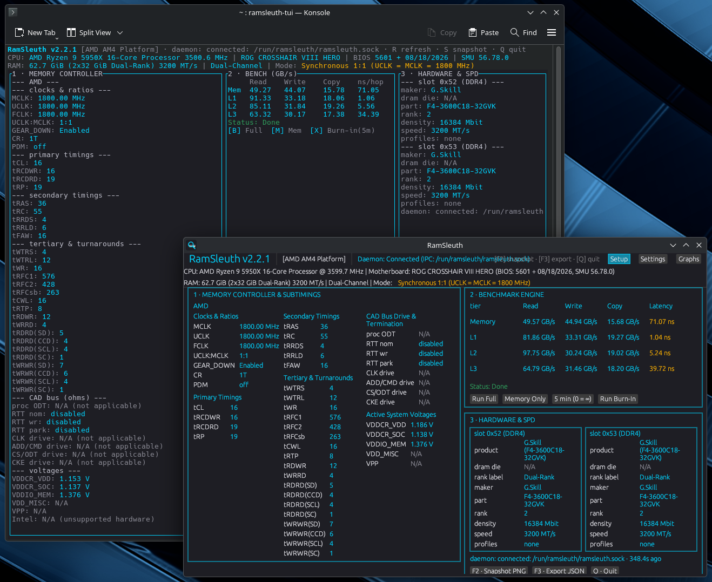

# RamSleuth v2.4.2

Live memory-controller telemetry and an AIDA64-style benchmark engine for AMD and Intel PC RAM — 100% pure Rust, dual frontend (terminal + desktop), one small-capability privileged daemon.



## What it is

RamSleuth is an 8-crate Rust workspace (7 product crates + the `tools/gen-icon` dev tool) with two layers: **live telemetry** of the memory controller's operating state, and an **AIDA64-style benchmark engine** for bandwidth and latency.

Every privileged read flows through a single root daemon that holds only `CAP_SYS_RAWIO` — all clients (the CLI, the TUI, the GUI) run fully unprivileged — and the no-panic contract means a missing driver, privilege, or piece of hardware never crashes anything: the affected fields render as a structured `N/A (<reason>)` and the process exits 0.

## Why RamSleuth

- **Live AMD memory-controller state** — SMU PM-table clocks (MCLK/UCLK/FCLK), 27 DRAM subtimings, GDM, and command rate via the `ryzen_smu` kernel driver.
- **Live Intel memory-controller state** — trained DRAM subtimings + the DRAM core clock, decoded from the IMC registers: the `ramsleuth_intel` kernel module's 24 sysfs attributes first (IMC subtimings + the 5 MAD channel/geometry registers), the host-bridge MCHBAR — a 64 KiB window — mapped read-only through `/dev/mem` as the fallback where the kernel permits. The Tier-1 decode targets the Skylake–Comet Lake DDR4 desktop line and is validated on Skylake; the channel-mode label is hardware-derived from `MAD_INTER_CHANNEL`, falling back to the installed-DIMM count when the module is absent.
- **Unprivileged SPD** — every DIMM's EEPROM decoded without root: JEP106 makers, rank, density, base speed, XMP 2.0/3.0 + EXPO profiles; the root daemon additionally attempts to bind any EEPROM the kernel's `ee1004` driver missed (SPD auto-bind, on by default — `--no-spd-autobind` to disable, non-fatal, never unbinds).
- **AIDA64-style 4×4 benchmark** — native AVX2/AVX-512F kernels, one worker pinned per physical core, pointer-chase latency, and an optional burn-in soak.
- **Dual frontend, full CLI** — the same live three-zone dashboard in a 16-key ratatui terminal UI and an egui desktop app, with 5-series graphs and PNG/JSON export.
- **Minimal privilege** — one daemon, `CAP_SYS_RAWIO` only, on a group-owned Unix socket.
- **No-panic by design** — absent hardware, drivers, or privileges degrade to `N/A (<reason>)`, exit 0.

## The 6 binaries

| Binary | What it is |
| --- | --- |
| `ramsleuth-daemon` | The privileged service — root with `CAP_SYS_RAWIO` only; serves telemetry, benchmark runs, and burn-in over a Unix socket. |
| `ramsleuth-client` | The unprivileged CLI — `dump` (the telemetry listing), `bench` (the streamed 4×4 grid), `status` (the per-section health summary). |
| `ramsleuth-tui` | The live terminal dashboard (ratatui) — the full GUI in a 16-key terminal UI; the key map lives in the User Guide. |
| `ramsleuth` | The desktop GUI (egui) — three-zone dashboard, dedicated graphs window, settings panel, and the one-click setup strip. |
| `ramsleuth-bench` | Standalone benchmark — runs the 4×4 AVX2/AVX-512F grid directly; no daemon required. |
| `ramsleuth-telemetry` | Standalone snapshot — the full telemetry dashboard as one text (or `--json`) listing; no daemon required. |

## Installation

**One-liner (from GitHub):**

```sh
git clone https://github.com/MadGoatHaz/RamSleuth && cd RamSleuth && ./install.sh
```

Self-contained and idempotent: it prints every source it uses and the exact commit it installs before doing anything, and a re-run after any failure is safe.

**AUR (Arch) — pick exactly one:**

```sh
yay -S ramsleuth      # STABLE — builds from the official release tag
yay -S ramsleuth-bin  # PRECOMPILED — downloads the release tarball (fastest install)
```

(`paru -S …` works in place of `yay`.)

**AMD live subtimings (optional extra):** `yay -S ryzen-smu-dkms` installs the third-party pinned `ryzen_smu` kernel driver; without it the AMD fields read `N/A (DriverMissing)` and everything else keeps serving — full details in the [User Guide](Docs/User_Guide.md).

**Intel live subtimings (optional extra):** `yay -S ramsleuth-intel-dkms` provides RamSleuth's own in-repo `ramsleuth_intel` kernel module — DKMS-built for your running kernel, exposing the raw IMC registers over world-readable sysfs; source and dev-branch installs ship the helper directly (`sudo ramsleuth-install-intel-dkms`), and the one-click setup routes to it automatically on Intel hosts (the published `ramsleuth-bin` binary carries the helper once the v2.4.2 re-cut is published). Without it the daemon falls back to the read-only `/dev/mem` MCHBAR map where the kernel permits, and the Intel fields read `N/A (DriverMissing)` where it does not — everything else keeps serving — full details in the [User Guide](Docs/User_Guide.md).

**Build from source:** `cargo build --workspace --release` — Rust MSRV 1.75, producing the 6 binaries above; system-library and per-path details in the [User Guide](Docs/User_Guide.md).

## Quickstart

1. **Install** — the `install.sh` one-liner above, or either AUR package.
2. **Open the app** — run `ramsleuth` (the GUI, or its desktop-menu entry); `ramsleuth-tui` is the terminal equivalent.
3. **One click** — on first launch the `SETUP` strip offers **Set up RamSleuth** (on AMD hosts: **Set up RamSleuth + AMD driver**): one polkit password prompt enables + starts the daemon, joins your user to the `ramsleuth` group, and grants a current-session socket ACL — no re-login, no reboot. No desktop? The same one step from a terminal is `sudo ramsleuth-setup` (add `--with-dkms` — AMD: the `ryzen_smu` driver; Intel: the `ramsleuth_intel` module).
4. **Read and run** — the dashboard is live from the first second: telemetry matrix, benchmark grid, and hardware/SPD status; start a benchmark from either frontend, or run the standalone tools.

The full walkthrough — every zone, key, flag, N/A reason, and day-2 troubleshooting — is in the [User Guide](Docs/User_Guide.md).

## Documentation

- [Architecture](Docs/Architecture.md) — the deep technical design: the two-layer model, the daemon and wire protocol, the 8-crate workspace map, every telemetry source, the benchmark engine, deployment, and testing/CI.
- [User Guide](Docs/User_Guide.md) — installation, first run, running the GUI / TUI / CLI / standalone tools, reading the data (clocks, subtimings, SPD/XMP/EXPO, N/A reasons), and day-2 troubleshooting.
- [Packaging & AUR](packaging/README.md) — the two-package AUR model, the unified version-bump flow, the `ryzen-smu-dkms` extra, and the CI/release artifact contracts.
- [Changelog](CHANGELOG.md) — release history.

**Versioning** — the single source of truth is `[workspace.package].version` in the root `Cargo.toml` (this tree: **2.4.2**); releases are tag-driven and the AUR packages follow in lockstep — the full policy lives in [packaging/README.md](packaging/README.md).

## License

MIT — the workspace `Cargo.toml` declares `license = "MIT"`. Repository: <https://github.com/MadGoatHaz/RamSleuth>.

RamSleuth v2.4.2 · branch `v2-development`
